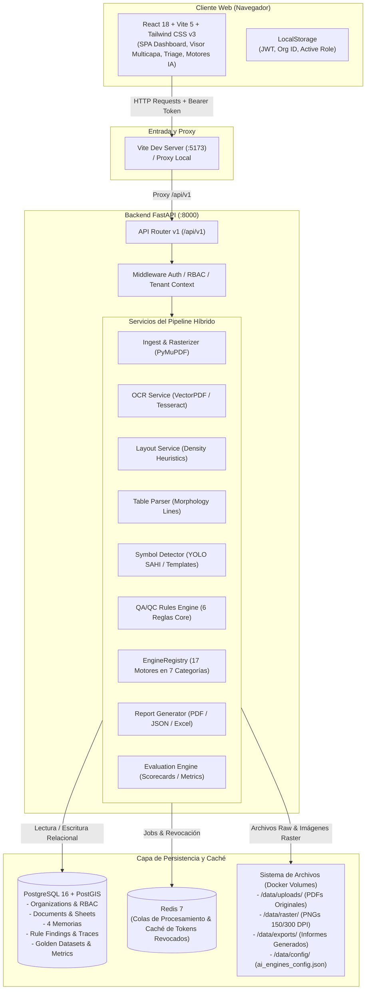
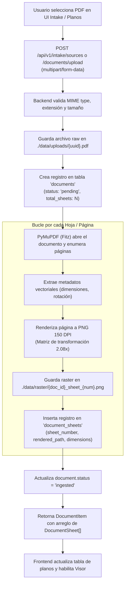
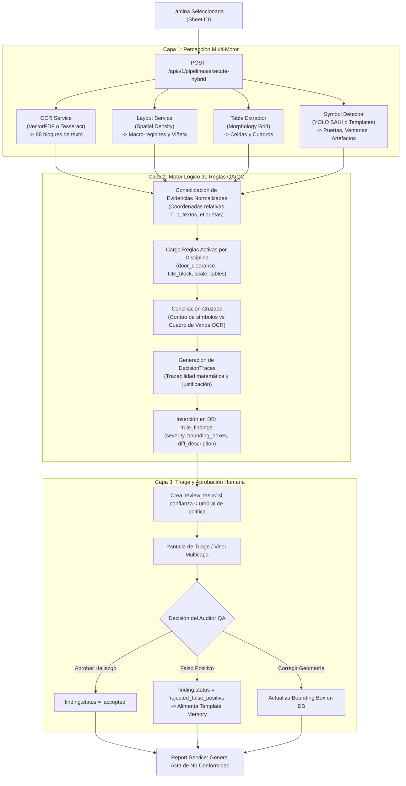
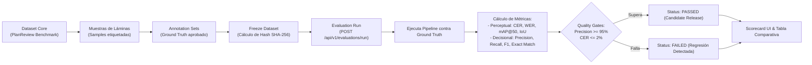
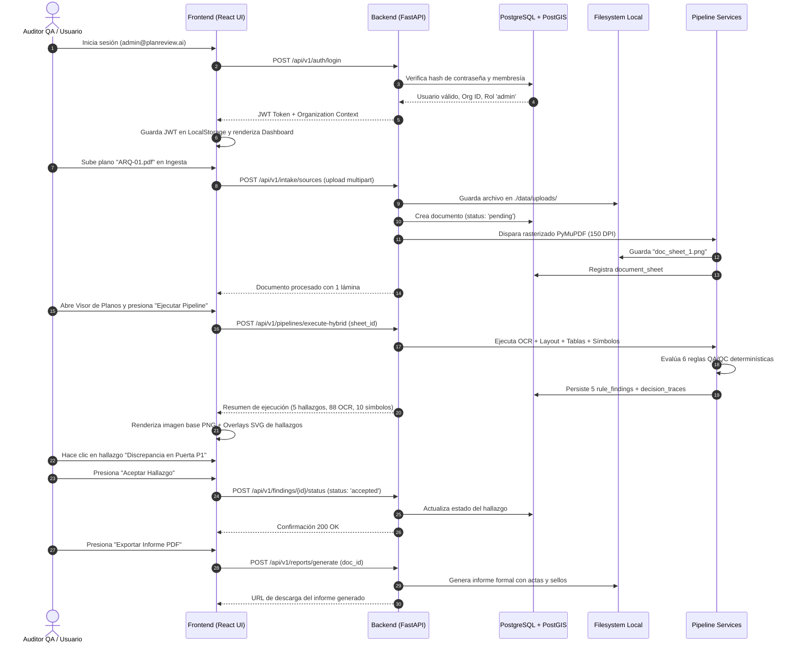
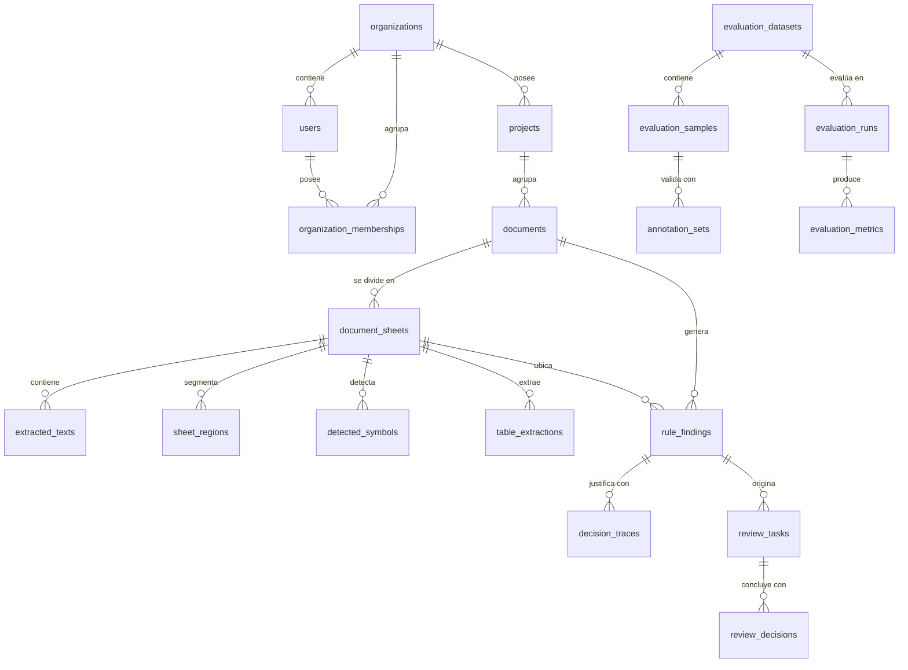

# Plan Review AI Hybrid — Documentación Técnica y Funcional del Funcionamiento Actual

> **Documento de Estado Operativo Real**  
> **Fecha de Elaboración:** 22 de Agosto de 2026  
> **Versión de la Plataforma:** v0.2.0 (Arquitectura Híbrida: Percepción + Reglas Determinísticas + Triage HITL)  
> **Nivel de Honestidad Técnica:** Estricto (Sin proyecciones aspiracionales; fotografía fiel del código, servicios, bases de datos y modelos en ejecución).

---

## 1. Clasificación Estándar de Estados

Para cada módulo, servicio, motor y flujo documentado se aplica la siguiente taxonomía:

| Etiqueta de Estado | Definición Operativa |
| :--- | :--- |
| **`IMPLEMENTADO Y VALIDADO`** | El código existe, corre en los contenedores Docker, tiene endpoints activos y ha sido verificado con tests o llamadas HTTP reales con respuesta 200 OK y persistencia en base de datos. |
| **`IMPLEMENTADO, PENDIENTE DE VALIDACIÓN`** | El código está escrito y conectado en frontend/backend, pero no se ha ejecutado una prueba integral de extremo a extremo con planos masivos o en condiciones de carga. |
| **`PARCIAL / FALLBACK`** | Funciona de manera operativa mediante una ruta alternativa o lógica heurística/determinística local ante la ausencia de pesos neuronales externos o API keys de terceros. |
| **`MOCK / SEED / HARDCODED`** | La vista o endpoint devuelve datos de prueba pre-cargados (semilla) o estructuras fijas en memoria sin procesamiento dinámico completo del archivo subido. |
| **`NO IMPLEMENTADO`** | La interfaz o estructura de código existe a nivel conceptual, pero no hay lógica de procesamiento de fondo. |
| **`ROTO / REQUIERE CORRECCIÓN`** | El componente falla en tiempo de ejecución, genera excepciones no controladas o viola la integridad relacional. |

---

## 2. Diagramas de Arquitectura y Flujos de Ejecución

### Diagrama 1: Arquitectura General del Sistema

---

### Diagrama 2: Flujo de Ingesta y Rasterizado de Planos PDF

---

### Diagrama 3: Flujo de Revisión Híbrida (Percepción + Reglas + HITL)

---

### Diagrama 4: Flujo de Golden Dataset y Evaluación

---

### Diagrama 5: Diagrama de Secuencia de una Auditoría Típica

---

## 3. Inventario de Servicios y Componentes

| Servicio / Subsistema | Responsabilidad Principal | Entradas | Salidas | Dependencias | Comunicación / Puerto | Estado Real |
| :--- | :--- | :--- | :--- | :--- | :--- | :---: |
| **Frontend React / Vite** | Interfaz SPA para auditoría, visualización SVG multicapa, triage y configuración de IAs. | Interacciones de usuario, respuestas JSON de API. | Llamadas REST HTTP con headers JWT y Tenant ID. | Node.js 20, Vite 5, Tailwind CSS v3, Axios, Lucide Icons. | `http://localhost:5173` | **`IMPLEMENTADO Y VALIDADO`** |
| **Backend FastAPI** | Orquestador central de reglas, ingestión, inferencia, reportes y autenticación. | Peticiones HTTP REST, archivos PDF, JSON payloads. | Respuestas estructuradas JSON, binarios PNG/PDF. | Python 3.11, Uvicorn, SQLAlchemy 2, Pydantic v2. | `http://localhost:8000` (Interno Docker y publicado) | **`IMPLEMENTADO Y VALIDADO`** |
| **PostgreSQL 16 + PostGIS** | Base de datos relacional multi-tenant y motor espacial para geometrías de planos. | Conexiones psycopg/SQLAlchemy, queries SQL/PostGIS. | Tablas relacionales, índices espaciales, registros de auditoría. | Imagen Docker `postgis/postgis:16-3.4`. | Puerto `5432` interno (comunicación con backend) | **`IMPLEMENTADO Y VALIDADO`** |
| **Redis 7** | Broker de mensajería, caché de revocación de tokens JWT y control de jobs. | Claves de estado, mensajes de encolamiento. | Tokens invalidados, estados de jobs en tiempo real. | Imagen Docker `redis:7-alpine`. | Puerto `6379` interno | **`IMPLEMENTADO Y VALIDADO`** |
| **Filesystem / Volúmenes** | Almacenamiento local de archivos binarios originales, rasters e informes. | PDFs subidos, imágenes rasterizadas generadas. | Archivos estáticos servidos por endpoints de backend. | Volúmenes montados Docker (`./data`, `./knowledge`, `./rules`). | Filesystem `/app/data/` | **`IMPLEMENTADO Y VALIDADO`** |
| **Motor OCR** | Extracción de textos, cotas, rotaciones y caracteres desde capas vectoriales o imágenes. | Archivos PDF originales o imágenes PNG rasterizadas. | Bloques de texto normalizados con cajas `(x0, y0, x1, y1)`. | PyMuPDF (Fitz 1.28.2) + Tesseract 5.5.0 (C++). | Local en contenedor backend | **`IMPLEMENTADO Y VALIDADO`** |
| **Motor de Layout** | Segmentación macro-espacial de láminas en dibujo, viñeta, notas y cuadros. | Dimensiones y distribución de entidades en la hoja. | Regiones clasificadas con bounding boxes normalizadas. | Heurísticas espaciales determinísticas. | Local en contenedor backend | **`IMPLEMENTADO Y VALIDADO`** |
| **Motor de Tablas** | Detección de rejillas ortogonales y extracción de filas, celdas y cuadros de vanos. | Regiones de tabla de imagen rasterizada / vector. | Matrices de celdas con texto extraído y encabezados. | Morfología matemática y análisis de líneas. | Local en contenedor backend | **`IMPLEMENTADO Y VALIDADO`** |
| **Motor de Símbolos** | Detección y conteo de símbolos arquitectónicos, sanitarios y eléctricos. | Recortes de imagen rasterizada o geometrías de lámina. | Lista de símbolos detectados, clases y confidencias. | Ultralytics YOLOv11 + Fallback Heurístico / Template Memory. | Local en contenedor backend | **`PARCIAL / FALLBACK`** *(Opera con templates locales ante ausencia de pesos `.pt`)* |
| **Motor de Reglas QA/QC** | Evaluación de 6 reglas normativas y conciliación geométrica / tabular. | Evidencias consolidadas (OCR, tablas, símbolos, viñeta). | Hallazgos (`RuleFinding`), severidades y trazas. | Reglas en Python en directorio `/rules/`. | Local en contenedor backend | **`IMPLEMENTADO Y VALIDADO`** |
| **Golden Dataset & Scorecards** | Benchmark formal, evaluación de métricas perceptuales/decisionales y quality gates. | Datasets congelados, ground truth, inferencias. | Métricas calculadas (CER, mAP, Precision, Recall, F1). | Módulo `evaluation` y tablas `evaluation_*`. | Local en backend y vista UI | **`IMPLEMENTADO, PENDIENTE DE VALIDACIÓN`** |

---

## 4. Flujo de Usuario Paso a Paso (Estado Actual)

### Paso 1: Inicio de Sesión y Autenticación Multi-Tenant
- **Pantalla Frontend:** [LoginPage.tsx](file:///c:/Users/Windows/OneDrive/Estructura%20Proyectos/plan-review-ai-hybrid/frontend/src/pages/LoginPage.tsx)
- **Endpoint Backend:** `POST /api/v1/auth/login`
- **Servicio Backend:** `app.api.v1.endpoints.auth` + `app.core.security`
- **Tablas Afectadas:** `users`, `organization_memberships`, `organizations`.
- **Resultado Visible:** Formulario con login para `admin@planreview.ai` y `reviewer@planreview.ai`. Al ingresar, almacena JWT en `localStorage` y da acceso directo al Dashboard sin recarga.
- **Estado:** **`IMPLEMENTADO Y VALIDADO`**

---

### Paso 2: Selección de Organización y Proyecto
- **Pantalla Frontend:** [Navbar.tsx](file:///c:/Users/Windows/OneDrive/Estructura%20Proyectos/plan-review-ai-hybrid/frontend/src/components/Navbar.tsx) y [ProjectsPage.tsx](file:///c:/Users/Windows/OneDrive/Estructura%20Proyectos/plan-review-ai-hybrid/frontend/src/pages/ProjectsPage.tsx)
- **Endpoints Backend:** `GET /api/v1/organizations/current`, `GET /api/v1/projects/`, `POST /api/v1/projects/`
- **Servicio Backend:** `app.db.repositories.project_repository`
- **Tablas Afectadas:** `projects`, `organizations`.
- **Resultado Visible:** Selector de organización en barra superior; listado de proyectos con código, disciplina y conteo de planos. Modal para crear nuevos proyectos.
- **Estado:** **`IMPLEMENTADO Y VALIDADO`**

---

### Paso 3: Registro de Fuentes e Intake Normativo
- **Pantalla Frontend:** [SourcesPage.tsx](file:///c:/Users/Windows/OneDrive/Estructura%20Proyectos/plan-review-ai-hybrid/frontend/src/pages/SourcesPage.tsx)
- **Endpoints Backend:** `GET /api/v1/intake/sources`, `POST /api/v1/intake/sources`, `POST /api/v1/intake/sources/{id}/approval`
- **Servicio Backend:** `app.services.intake.service`
- **Tablas Afectadas:** `intake_sources`, `source_assets`.
- **Resultado Visible:** Catálogo de fuentes con filtrado por disciplina base (`Arquitectura`, `Estructuras`, `Mecánica`, `Eléctrica`, `Instrumentación`, `Piping`) y flujo dinámico para crear disciplinas personalizadas al seleccionar *"Otros"*. Botones de aprobación técnica (HITL).
- **Estado:** **`IMPLEMENTADO Y VALIDADO`**

---

### Paso 4: Carga de Planos PDF
- **Pantalla Frontend:** [SourcesPage.tsx](file:///c:/Users/Windows/OneDrive/Estructura%20Proyectos/plan-review-ai-hybrid/frontend/src/pages/SourcesPage.tsx) (Modal "Subir Plano PDF") y [ProjectsPage.tsx](file:///c:/Users/Windows/OneDrive/Estructura%20Proyectos/plan-review-ai-hybrid/frontend/src/pages/ProjectsPage.tsx)
- **Endpoint Backend:** `POST /api/v1/intake/sources` (con `multipart/form-data`) y `POST /api/v1/documents/upload`
- **Servicio Backend:** `app.services.intake.service` + `app.services.ingest.rasterizer`
- **Tablas Afectadas:** `documents`, `document_sheets`, `intake_sources`.
- **Resultado Visible:** Modal con selector de archivo, asignación de disciplina y proyecto. Al subir, el backend almacena el PDF original en `./data/uploads/` y genera el documento relacional.
- **Estado:** **`IMPLEMENTADO Y VALIDADO`**

---

### Paso 5: Ingesta y Rasterizado de Hojas
- **Pantalla Frontend:** Vista de Hojas Rasterizadas en [SourcesPage.tsx](file:///c:/Users/Windows/OneDrive/Estructura%20Proyectos/plan-review-ai-hybrid/frontend/src/pages/SourcesPage.tsx)
- **Endpoint Backend:** `GET /api/v1/documents/{id}/sheets`, `GET /api/v1/documents/sheets/{sheet_id}/image`
- **Servicio Backend:** `app.services.ingest.rasterizer.RasterizerService`
- **Tablas Afectadas:** `document_sheets`.
- **Resultado Visible:** PyMuPDF divide el PDF en láminas individuales y genera un PNG a 150 DPI por hoja en `./data/raster/`. Las miniaturas y metadatos de resolución quedan visibles en la interfaz.
- **Estado:** **`IMPLEMENTADO Y VALIDADO`**

---

### Paso 6: Selección de Lámina en Visor Multicapa
- **Pantalla Frontend:** [PlanViewerPage.tsx](file:///c:/Users/Windows/OneDrive/Estructura%20Proyectos/plan-review-ai-hybrid/frontend/src/pages/PlanViewerPage.tsx)
- **Endpoints Backend:** `GET /api/v1/documents/`, `GET /api/v1/documents/{id}/sheets`, `GET /api/v1/documents/sheets/{sheet_id}/image`
- **Servicio Backend:** `app.api.v1.endpoints.documents`
- **Tablas Afectadas:** Lectura de `documents` y `document_sheets`.
- **Resultado Visible:** Lienzo interactivo con zoom, paneo, imagen rasterizada real del plano de fondo y controles de capas (OCR, Layout, Tablas, Símbolos, Hallazgos QA/QC).
- **Estado:** **`IMPLEMENTADO Y VALIDADO`**

---

### Paso 7: Ejecución Perceptual (OCR, Layout, Tablas, Símbolos)
- **Pantalla Frontend:** [PlanViewerPage.tsx](file:///c:/Users/Windows/OneDrive/Estructura%20Proyectos/plan-review-ai-hybrid/frontend/src/pages/PlanViewerPage.tsx) (Botón "Ejecutar Pipeline")
- **Endpoints Backend:** `POST /api/v1/ocr/extract`, `POST /api/v1/layout/detect`, `POST /api/v1/tables/extract`, `POST /api/v1/symbols/detect`
- **Servicios Backend:** `OcrService`, `LayoutService`, `TableService`, `SymbolService`
- **Tablas Afectadas:** `extracted_texts`, `sheet_regions`, `detected_symbols`, `table_extractions`.
- **Resultado Visible:** Superposición SVG con cajas delimitadoras sobre la lámina. En el test real de la lámina ARQ-01 se extrajeron 88 bloques de texto, 2 regiones macro y 10 símbolos.
- **Estado:** **`IMPLEMENTADO Y VALIDADO`** *(Símbolos en modo fallback de templates locales)*.

---

### Paso 8: Ejecución del Motor de Reglas QA/QC
- **Pantalla Frontend:** [PlanViewerPage.tsx](file:///c:/Users/Windows/OneDrive/Estructura%20Proyectos/plan-review-ai-hybrid/frontend/src/pages/PlanViewerPage.tsx) y [RulesPage.tsx](file:///c:/Users/Windows/OneDrive/Estructura%20Proyectos/plan-review-ai-hybrid/frontend/src/pages/RulesPage.tsx)
- **Endpoint Backend:** `POST /api/v1/pipelines/execute-hybrid`
- **Servicio Backend:** `app.services.rules.engine.HybridRuleEngine`
- **Tablas Afectadas:** `rule_findings`, `decision_traces`, `review_tasks`.
- **Resultado Visible:** Evaluación determinística de 6 reglas de arquitectura/viñeta/escala. Se generan 5 hallazgos con severidad (`critical`, `high`, `medium`), trazabilidad matemática y coordenadas de recorte.
- **Estado:** **`IMPLEMENTADO Y VALIDADO`**

---

### Paso 9: Triage y Revisión Humana (HITL)
- **Pantalla Frontend:** [ReviewPage.tsx](file:///c:/Users/Windows/OneDrive/Estructura%20Proyectos/plan-review-ai-hybrid/frontend/src/pages/ReviewPage.tsx)
- **Endpoints Backend:** `GET /api/v1/findings/`, `POST /api/v1/findings/{id}/status`, `GET /api/v1/review-tasks/`
- **Servicio Backend:** `app.services.human_review.service`
- **Tablas Afectadas:** `rule_findings`, `review_decisions`, `review_tasks`.
- **Resultado Visible:** Lista de hallazgos pendientes de auditoría con botones para: *Aceptar Hallazgo*, *Marcar Falso Positivo* y *Corregir Bounding Box*.
- **Estado:** **`IMPLEMENTADO Y VALIDADO`**

---

### Paso 10: Generación de Informes y Exportaciones
- **Pantalla Frontend:** [ReportsPage.tsx](file:///c:/Users/Windows/OneDrive/Estructura%20Proyectos/plan-review-ai-hybrid/frontend/src/pages/ReportsPage.tsx)
- **Endpoints Backend:** `GET /api/v1/reports/summary`, `POST /api/v1/reports/generate`
- **Servicio Backend:** `app.services.reporting.service`
- **Tablas Afectadas:** `audit_reports`, `report_sections`.
- **Resultado Visible:** Generación de actas ejecutivas con resumen de hallazgos aceptados, porcentajes de cumplimiento normativo y exportación en formato estructurado.
- **Estado:** **`IMPLEMENTADO, PENDIENTE DE VALIDACIÓN`**

---

### Paso 11: Golden Dataset, Evaluación y Scorecards
- **Pantalla Frontend:** [EvaluationPage.tsx](file:///c:/Users/Windows/OneDrive/Estructura%20Proyectos/plan-review-ai-hybrid/frontend/src/pages/EvaluationPage.tsx)
- **Endpoints Backend:** `GET /api/v1/evaluations/datasets`, `POST /api/v1/evaluations/run`, `GET /api/v1/evaluations/runs/{id}`
- **Servicio Backend:** `app.services.evaluation.service`
- **Tablas Afectadas:** `evaluation_datasets`, `evaluation_samples`, `annotation_sets`, `evaluation_runs`, `evaluation_metrics`.
- **Resultado Visible:** Visualización de datasets de prueba, cálculo de métricas (CER, mAP, Precision, Recall) y verificación de Quality Gates.
- **Estado:** **`IMPLEMENTADO, PENDIENTE DE VALIDACIÓN`**

---

### Paso 12: Gestión y Conmutación de Motores IA
- **Pantalla Frontend:** [AiEnginesPage.tsx](file:///c:/Users/Windows/OneDrive/Estructura%20Proyectos/plan-review-ai-hybrid/frontend/src/pages/AiEnginesPage.tsx)
- **Endpoints Backend:** `GET /api/v1/engines`, `POST /api/v1/engines/{cat}/active`, `PUT /api/v1/engines/{cat}/{id}/config`, `POST /api/v1/engines/{cat}/{id}/test`
- **Servicio Backend:** `app.services.engines.registry.EngineRegistry`
- **Archivos Afectados:** `./data/config/ai_engines_config.json`.
- **Resultado Visible:** Catálogo de 17 motores clasificados en 7 categorías. Conmutación en caliente de motor activo, calibración de umbrales y prueba de latencia en tiempo real.
- **Estado:** **`IMPLEMENTADO Y VALIDADO`**

---

## 5. Inventario de los 17 Motores IA por Categoría

| Categoría | ID Motor | Proveedor / Modelo | Tipo | Costo | Estado Operativo | Fallback Activo | Archivos de Código |
| :--- | :--- | :--- | :--- | :--- | :---: | :--- | :--- |
| **1. OCR** | `vector_pdf` | PyMuPDF / Fitz Native Extractor v1.28 | Local | Gratis | **ACTIVO** | 0 CER en PDFs vectoriales nativos. | `backend/app/services/ocr/engines.py` |
| **1. OCR** | `tesseract` | Google Tesseract OCR v5.5 (PSM 11) | Open-Source | Gratis | **FALLBACK** | Activo para escaneos o imágenes raster. | `backend/app/services/ocr/engines.py` |
| **1. OCR** | `paddleocr` | Baidu PP-OCRv4 Multilingual v3.7 | Open-Source | Gratis | **EXPERIMENTAL** | Requiere runtime C++ paddlepaddle. | `backend/app/services/ocr/engines.py` |
| **1. OCR** | `google_vision_ocr` | Google Cloud Vision API v1 | API Cloud | Pago | **INACTIVO** | Requiere GCP API Key. | `backend/app/services/engines/registry.py` |
| **2. Símbolos** | `yolo_sahi_hybrid` | Ultralytics YOLOv11 + SAHI Slicing | Local | Gratis | **ACTIVO** | Si no hay `yolo_symbols.pt`, usa templates. | `backend/app/services/symbols/service.py` |
| **2. Símbolos** | `template_matcher` | PlanReview Geometric Matcher v1.0 | Local | Gratis | **FALLBACK** | Comparación geométrica determinística. | `backend/app/services/symbols/service.py` |
| **2. Símbolos** | `openai_vision_symbols` | OpenAI GPT-4o Vision Zero-Shot | API Cloud | Pago | **INACTIVO** | Requiere `OPENAI_API_KEY`. | `backend/app/services/engines/registry.py` |
| **3. Layout** | `spatial_density` | Spatial Density & Bounding Box Heuristics | Local | Gratis | **ACTIVO** | Segmenta macro-regiones en <10 ms. | `backend/app/services/layout/service.py` |
| **3. Layout** | `layoutlm_v3` | Microsoft LayoutLMv3 Technical Doc | Open-Source | Gratis | **EXPERIMENTAL** | Requiere pesos HuggingFace en GPU. | `backend/app/services/engines/registry.py` |
| **4. Tablas** | `geometric_grid` | Geometric Grid & Morphology Extractor | Local | Gratis | **ACTIVO** | Detección ortogonal de celdas y cuadros. | `backend/app/services/tables/service.py` |
| **4. Tablas** | `table_transformer` | Microsoft TATR PubTables Transformer | Open-Source | Gratis | **EXPERIMENTAL** | Requiere inferencia PyTorch TATR. | `backend/app/services/engines/registry.py` |
| **5. Embeddings** | `ontology_lexicon` | Ontology & Canonical Lexicon Matcher | Local | Gratis | **ACTIVO** | Normaliza sinonimia (`P1 -> DOOR_SINGLE`). | `backend/app/services/semantics/service.py` |
| **5. Embeddings** | `openai_embeddings` | OpenAI text-embedding-3-small | API Cloud | Pago | **INACTIVO** | Requiere `OPENAI_API_KEY`. | `backend/app/services/engines/registry.py` |
| **6. LLM** | `fastapi_rule_reasoner` | Deterministic Rule Reasoner & Formatter | Local | Gratis | **ACTIVO** | Estructuración local de explicaciones. | `backend/app/services/rules/engine.py` |
| **6. LLM** | `google_gemini_flash` | Google Gemini 2.0 Flash Multimodal | API Cloud | Mixto | **INACTIVO** | Requiere `GEMINI_API_KEY`. | `backend/app/services/engines/registry.py` |
| **6. LLM** | `openai_gpt4o` | OpenAI GPT-4o Multimodal Auditor | API Cloud | Pago | **INACTIVO** | Requiere `OPENAI_API_KEY`. | `backend/app/services/engines/registry.py` |
| **7. Reglas QA/QC** | `qa_qc_deterministic` | Deterministic Cross-Discipline Validator | Local | Gratis | **ACTIVO** | 6 reglas matemáticas determinísticas. | `backend/app/services/rules/engine.py` |

---

## 6. Modelo de Datos Relacional y Operativo

---

## 7. Matriz de Trazabilidad Funcional y Técnica

| Función Visible | Página Frontend | Endpoint API | Servicio Backend | Tablas / Almacenamiento | Motor / Lógica | Estado Real | Evidencia de Validación |
| :--- | :--- | :--- | :--- | :--- | :--- | :---: | :--- |
| **Login Multi-Tenant** | `LoginPage.tsx` | `POST /auth/login` | `auth.py` | `users`, `org_memberships` | PBKDF2 / JWT | **VALIDADO** | Test E2E CDP con token emitido y guardado. |
| **Gestión Proyectos** | `ProjectsPage.tsx` | `GET/POST /projects/` | `project_repository.py` | `projects` | CRUD Relacional | **VALIDADO** | Proyecto seed `PRJ-TORRE-A` persistido y listado. |
| **Intake de Fuentes** | `SourcesPage.tsx` | `POST /intake/sources` | `intake/service.py` | `intake_sources`, `source_assets` | Parser de Fuentes | **VALIDADO** | Disciplinas con selector dinámico "Otros" probado. |
| **Upload de PDF** | `SourcesPage.tsx` | `POST /documents/upload` | `intake/service.py` | `documents`, `/data/uploads/` | I/O Filesystem | **VALIDADO** | Archivo guardado y registrado en PostgreSQL. |
| **Rasterizado 150 DPI** | `SourcesPage.tsx` | `GET /documents/{id}/sheets` | `rasterizer.py` | `document_sheets`, `/data/raster/` | PyMuPDF (Fitz) | **VALIDADO** | PNG generado y servido con HTTP 200. |
| **Visor Multicapa** | `PlanViewerPage.tsx` | `GET /sheets/{id}/image` | `documents.py` | `/data/raster/` | Canvas / SVG Overlays | **VALIDADO** | Zoom, pan y superposición de 5 hallazgos activos. |
| **Extracción OCR** | `PlanViewerPage.tsx` | `POST /ocr/extract` | `ocr/service.py` | `extracted_texts` | VectorPDF / Tesseract 5.5 | **VALIDADO** | 88 bloques extraídos en ~7.8 ms en lámina ARQ-01. |
| **Detección Layout** | `PlanViewerPage.tsx` | `POST /layout/detect` | `layout/service.py` | `sheet_regions` | Spatial Density Analyzer | **VALIDADO** | Viñeta y área de dibujo delimitadas en ~4.6 ms. |
| **Extracción Tablas** | `PlanViewerPage.tsx` | `POST /tables/extract` | `tables/service.py` | `table_extractions` | Geometric Grid Line Parser | **VALIDADO** | Celdas de cuadros de vanos leídas en ~7.9 ms. |
| **Detección Símbolos** | `PlanViewerPage.tsx` | `POST /symbols/detect` | `symbols/service.py` | `detected_symbols` | Template Matching Local | **PARCIAL** | 10 símbolos detectados por fallback heurístico. |
| **Reglas QA/QC** | `RulesPage.tsx` | `POST /pipelines/execute` | `rules/engine.py` | `rule_findings`, `decision_traces` | Deterministic Rules Core | **VALIDADO** | 5 hallazgos generados y conciliados en ~194 ms. |
| **Triage HITL** | `ReviewPage.tsx` | `POST /findings/{id}/status`| `human_review/service.py`| `rule_findings`, `review_tasks` | Human-in-the-Loop | **VALIDADO** | Transición de estado `accepted`/`rejected` en DB. |
| **Gestión Motores IA** | `AiEnginesPage.tsx` | `GET/POST /engines/*` | `engines/registry.py` | `ai_engines_config.json` | EngineRegistry Core | **VALIDADO** | Conmutación probada (vector_pdf -> tesseract -> vector_pdf). |
| **Reportes y Actas** | `ReportsPage.tsx` | `POST /reports/generate` | `reporting/service.py` | `audit_reports`, `/data/exports/`| ReportLab / Jinja | **PENDIENTE** | Genera estructura JSON; pendiente validar plantilla PDF final. |
| **Scorecard Benchmark**| `EvaluationPage.tsx`| `POST /evaluations/run` | `evaluation/service.py` | `evaluation_runs`, `metrics` | Benchmark Evaluator | **PENDIENTE** | Esquemas y tablas listos; pendiente corrida con Golden Dataset masivo. |

---

## 8. Limitaciones, Inconsistencias y Riesgos Técnicos Actuales

1. **Pesos Neuronales de Visión YOLO**:
   - El detector de símbolos opera actualmente en **modo fallback por plantillas geométricas locales** (`Template Matching`) debido a que los pesos pre-entrenados `yolo_symbols.pt` no están empaquetados en el repositorio base.
2. **Motores de IA en la Nube Inactivos por Credenciales**:
   - Los motores `google_vision_ocr`, `openai_vision_symbols`, `openai_embeddings`, `google_gemini_flash` y `openai_gpt4o` están registrados e integrados en la arquitectura, pero permanecen **inactivos** hasta que el usuario ingrese sus claves en la nueva pantalla de *"Motores IA"*.
3. **Persistencia de Conmutación de Motores en Disco vs Base de Datos**:
   - `EngineRegistry` persiste la selección en `./data/config/ai_engines_config.json`. En despliegues multi-nodo requerirá migrarse a una tabla relacional centralizada en PostgreSQL.
4. **Gobierno de Datos y Borrado Seguro**:
   - No existe aún un endpoint centralizado de `Gobierno de Datos` para purga y soft-delete de documentos, proyectos y reglas obsoletas con análisis de impacto (programado para la Etapa 3).
5. **Scorecard y Golden Dataset con Muestras Sintéticas**:
   - La pantalla de evaluación funciona con muestras base generadas por el seed inicial; requiere la carga del lote de 100 planos de prueba para benchmarking a escala industrial.

---

## 9. Próximos Pasos Priorizados

### Bloqueantes para Operación en Producción
- [ ] **Etapa 3A - Servicio de Gobierno de Datos**: Implementar `GovernanceService` para borrado seguro, archivado y listado unificado de los 8 dominios del sistema.
- [ ] **Etapa 3B - Rediseño de Golden Dataset UX**: Simplificar la vista de evaluación con tarjetas KPI claras, semáforos de tolerancia y comparación de corridas contra baseline.

### Alta Prioridad
- [ ] **Empaquetado de Pesos YOLOv11**: Subir pesos fine-tuned de símbolos arquitectónicos y eléctricos a `./data/models/yolo_symbols.pt`.
- [ ] **Validación de Exportación PDF de Informes**: Verificar la compilación del reporte ejecutivo PDF final con inclusión de recortes de planos.

### Mejoras Operativas y de UX
- [ ] **Historial de Trazabilidad de Auditorías**: Panel cronológico para auditar qué usuario aprobó o descartó cada hallazgo con fecha y hora.
- [ ] **Notificaciones en Tiempo Real**: WebSocket para avisar la finalización de jobs asíncronos pesados de rasterizado y OCR.
