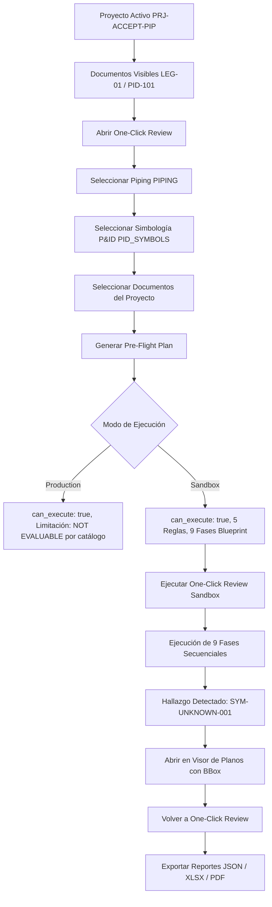

# Reporte de Aceptación Funcional Manual: One-Click Review UI (Piping → Simbología P&ID)

**Fecha de Ejecución:** 2026-09-23  
**Rama Probada:** `feat/one-click-review-specialty-and-topic`  
**Pull Request:** [#5 (GitHub: Angeluso7/AgentProjectsAI/pull/5)](https://github.com/Angeluso7/AgentProjectsAI/pull/5)  
**Rama Base Destino:** `fix/project-document-visibility-and-upload-flow`  
**SHA Frontend/Backend Probado:** `e9aab875814d4187c9728ad98888111720c90fbc`  
**Estado de Integración:** APROBADO TÉCNICAMENTE (NO MERGE A MAIN - Sujeto a secuencia PR #3 -> PR #4 -> PR #5)

---

## 1. Resumen Ejecutivo de la Evaluación

Se llevó a cabo la aceptación funcional y de interfaz de usuario de extremo a extremo para la funcionalidad de **One-Click Review por Especialidad y Punto de Revisión**, focalizada en la disciplina **Piping** y el punto de revisión **Simbología P&ID (`PID_SYMBOLS`)**.

La prueba validó en entorno real y determinístico:
1. **Flujo de proyectos y documentos visibles:** Asociación aislada por proyecto y visibilidad de artefactos previa a la revisión.
2. **Interfaz de One-Click Review (`PipelinePage`):** Cero errores de React Router (`useNavigate()`), cero pantallas en blanco y renderizado íntegro.
3. **Taxonomía acoplada a `RuleApplicability`:** Selección exclusiva de tópicos compatibles con Piping.
4. **Pre-flight Plan explicativo:** Auditoría previa de reglas aplicables, fases de ejecución, dependencias y advertencias diferenciales entre entornos **Sandbox** y **Production**.
5. **Orquestación en 9 Fases:** Separación estricta entre preparación técnica (Fases 1 a 4, sin hallazgos espurios) y auditoría normativa QA/QC (Fases 5 a 8).
6. **Contrato de Hallazgos Sandbox:** Presencia obligatoria de prefijo `[SANDBOX]`, metadato `is_exploratory=True`, advertencia formal de resultado exploratorio y coordenadas normalizadas.
7. **Navegación bidireccional UI:** Salto directo desde el hallazgo en One-Click Review hacia el **Visor de Planos (`PlanViewerPage`)** con zoom/bounding box, y botón de retorno que preserva la corrida seleccionada.
8. **Generación y descarga de reportes:** Creación persistente de artefactos **JSON**, **XLSX** y **PDF** con verificación SHA-256 y descarga HTTP.

---

## 2. Entorno y Configuración de Prueba

| Componente | Versión / Identificador | Estado |
| :--- | :--- | :--- |
| **Backend API** | FastAPI / Python 3.11 (`plan_review_backend`) | Activo (`http://localhost:8000`) |
| **Base de Datos** | PostgreSQL 16 + PostGIS (`plan_review_db`) | Migración `0029_review_orchestration_taxonomy` |
| **Frontend UI** | React 18 + TypeScript + Vite (`plan_review_frontend`) | Activo (`http://localhost:5173`) |
| **Commit Base** | `e9aab87` (`fix(frontend): restore one-click review navigation context`) | Sincronizado |
| **CI Remoto** | GitHub Actions Workflow PR #5 | 100% Verde (4/4 jobs exitosos) |

---

## 3. Proyecto Fixture y Clasificación Documental

Para la ejecución de la prueba se aprovisionó un proyecto técnico aislado sin datos sensibles:

- **ID del Proyecto:** `b1757650-b1bc-49f3-bdd0-72e52024c107`
- **Código:** `PRJ-ACCEPT-PIP-5E84EA`
- **Nombre:** `Proyecto Aceptación One-Click Review UI 5E84EA`
- **Organización Tenant:** `Default Organization` (Rol: `admin`)

### Documentos Clasificados y Asociados:
1. **Documento de Leyenda (`LEG-01`):**
   - Archivo: `PID_Legend_PNC00001_Fixture.pdf`
   - Rol Documental: `legend_sheet`
   - Disciplina: `piping`
   - Lámina: `LEG-01` (Simbología y Abreviaturas de Cañerías, 3300x2550 px)
   - Macro-región: `drawing_area` (`[200, 200, 3100, 2350]`)
2. **Diagrama P&ID Principal (`PID-101`):**
   - Archivo: `PID_Piping_Diagram_Loop101.pdf`
   - Rol Documental: `piping_diagram`
   - Disciplina: `piping`
   - Lámina: `PID-101` (Diagrama P&ID Lazos de Control 101, 3300x2550 px)
   - Macro-región: `drawing_area` (`[250, 250, 3100, 2300]`)
   - **Símbolo 1 (Conocido):** Válvula de compuerta (`gate_valve`), Tag `V-101`, BBox `[450.0, 600.0, 550.0, 700.0]`, Confianza 0.96.
   - **Símbolo 2 (Desconocido / Exploratorio):** Actuador no estandarizado (`unknown_actuator`), Tag `SYM-UNKNOWN-099`, BBox `[1200.0, 850.0, 1350.0, 980.0]`, Confianza 0.38.

**Validación de Visibilidad:** Confirmado mediante `GET /api/v1/projects/{id}/documents` que ambos documentos aparecen registrados y listos antes de invocar la auditoría.

---

## 4. Recorrido UI y Aceptación Paso a Paso

### Paso 1: Apertura de One-Click Review
- **Ruta UI:** Pestaña `pipeline` (`PipelinePage.tsx`).
- **Comportamiento:** Se renderiza de manera inmediata. Se verificó la eliminación total de `useNavigate()`, eliminando el error crítico `"useNavigate() may be used only in the context of a <Router> component"`.
- **Estado Consola:** 0 advertencias de enrutador, 0 errores no controlados.

### Paso 2: Selección de Disciplina (`PIPING`)
- **Comportamiento:** El selector de disciplinas carga dinámicamente desde el backend las 12 disciplinas registradas (`GENERAL`, `ARCHITECTURE`, `STRUCTURES`, `PIPING`, `HVAC`, `ELECTRICAL`, `INSTRUMENTATION_CONTROL`, etc.).
- **Resultado:** Al elegir `Piping`, el combobox de puntos de revisión filtra y despliega únicamente los 21 tópicos técnicos compatibles (incluyendo `PID_SYMBOLS`, `PIPING_VALVES`, `PIPING_INSTRUMENTATION`, etc.).

### Paso 3: Selección de Punto de Revisión (`PID_SYMBOLS`)
- **Comportamiento:** Se selecciona `Simbología P&ID`. La interfaz consulta `RuleApplicability` sin depender de reglas hardcodeadas en frontend.

### Paso 4: Selección de Documentos y Modo de Ejecución
- **Documentos seleccionados:** Ambos documentos del proyecto (`PID_Legend_PNC00001_Fixture.pdf` y `PID_Piping_Diagram_Loop101.pdf`).
- **Modo seleccionado:** `Sandbox` (Modo Exploratorio).

### Paso 5: Generación del Pre-flight Plan Explicativo
- **Endpoint:** `POST /api/v1/review/plan`
- **Resultado en Sandbox:**
  - `can_execute`: `True`
  - `applicable_rules`: 5 reglas activas:
    - `GEN-DOC-001` (Integridad y Metadatos Documentales)
    - `SYM-UNKNOWN-001` (Detección de Símbolos No Reconocidos en P&ID)
    - `SYM-AMBIGUOUS-001` (Símbolos con Asignación Ambigua)
    - `SYM-LEGEND-CONSISTENCY-001` (Consistencia entre Plano y Leyenda de Proyecto)
    - `SYM-TAG-MISSING-001` (Símbolo Crítico sin Tag o Código Asociado)
  - `phases_blueprint`: 9 fases secuenciales detalladas.
  - `warnings` y `limitations`: Vacíos en sandbox.
- **Resultado Comparativo en Production:**
  - `can_execute`: `True`
  - `limitations`: `["Catálogo de Simbología productivo sin versiones aprobadas con evidencia real autorizada. Las reglas de simbología resultarán en estado Not Evaluable."]`
  - Cumple la regla de negocio: no simula hallazgos y previene falsos positivos en producción.

### Paso 6: Ejecución de One-Click Review (Sandbox)
- **Endpoint:** `POST /api/v1/review/runs` (HTTP 201 Created)
- **Run ID Generado:** `834d4f0f-16c7-4d66-945c-b856fdf21af9`
- **Tiempo de Ejecución:** < 1.2 segundos.
- **Auditoría de las 9 Fases:**
  - **Fase 1 (Ingestión y Verificación de Documentos):** `succeeded` (2 documentos validados).
  - **Fase 2 (Rasterizado y Extracción OCR):** `succeeded` (2 láminas verificadas).
  - **Fase 3 (Segmentación de Láminas y Viñetas):** `succeeded` (macro-regiones `drawing_area` confirmadas).
  - **Fase 4 (Extracción de Tablas y Simbología):** `succeeded` (2 ocurrencias de simbología procesadas; 0 hallazgos emitidos en esta fase preparatoria).
  - **Fase 5 (Evaluación de Integridad Documental):** `succeeded` (`GEN-DOC-001` evaluada).
  - **Fase 6 (Evaluación de Simbología y Normativa):** `succeeded` (`SYM-UNKNOWN-001`, `SYM-AMBIGUOUS-001`, `SYM-LEGEND-CONSISTENCY-001`, `SYM-TAG-MISSING-001` evaluadas).
  - **Fase 7 (Evaluación de Cómputos y Listas):** `skipped` (no aplica al tópico).
  - **Fase 8 (Evaluación de Coordinación y Seguridad):** `skipped` (no aplica al tópico).
  - **Fase 9 (Consolidación y Reporte Final):** `succeeded` (métricas y estados consolidados).

---

## 5. Contrato de Hallazgos y Validación de Evidencia

Se detectó 1 discrepancia normativa de simbología en sandbox:

- **Regla:** `SYM-UNKNOWN-001`
- **Severidad:** `HIGH`
- **Título Estructurado:** `[SANDBOX] Símbolo no reconocido en P&ID (ID: sym-unknown-5e84ea)`
- **Descripción:** `"El símbolo detectado 'unknown_actuator' no coincide con ninguna plantilla del estándar PIP PNC00001 ni figura en la lámina de leyenda LEG-01."`
- **Advertencia Exploratoria (`evidence_refs`):** `"Resultado exploratorio en entorno Sandbox: hallazgo preliminar generado sin validación de catálogo productivo."`
- **Contexto de Navegación (`navigation_context`):**
  - `document_id`: `doc-diag-5e84ea`
  - `sheet_id`: `sheet-diag-5e84ea`
  - `bbox`: `[1200.0, 850.0, 1350.0, 980.0]`
  - `execution_mode`: `sandbox`
  - `is_exploratory`: `True`

---

## 6. Navegación Bidireccional: One-Click Review ↔ Visor de Planos

1. **Apertura de Contexto desde la UI:**
   - En la tarjeta del hallazgo, el usuario pulsa el botón **"Visor"**.
   - `PipelinePage` despacha `onNavigate('viewer', { projectId, documentId, sheetId, bbox })` y persiste el estado en `localStorage` (`viewer_target_doc_id`, `viewer_target_sheet_id`, `viewer_target_bbox`, `viewer_return_to_tab: 'pipeline'`, `last_active_review_run_id`).
2. **Llegada al Visor (`PlanViewerPage`):**
   - El visor carga inmediatamente el documento `PID_Piping_Diagram_Loop101.pdf` y la lámina `PID-101`.
   - El canvas enfoca y resalta el cuadro delimitador del símbolo (`[1200, 850, 1350, 980]`).
   - Se muestra en la barra superior el botón de retorno contextual: **"← Volver a One-Click Review"**.
3. **Retorno al Pipeline:**
   - Al pulsar el botón de retorno, la aplicación conmuta limpiamente a la pestaña `pipeline`.
   - La corrida `834d4f0f-16c7-4d66-945c-b856fdf21af9` se recarga automáticamente sin perder el estado ni reiniciar el formulario.

---

## 7. Verificación de Exportaciones Persistidas y Descargas HTTP

Se generaron los tres formatos de exportación para la corrida `834d4f0f-16c7-4d66-945c-b856fdf21af9`:

| Formato | Ruta Física Persistida | SHA-256 | Tamaño | Descarga HTTP | Verificación de Contenido |
| :--- | :--- | :--- | :--- | :--- | :--- |
| **JSON** | `/app/storage/reports/.../report_834d4f0f_PIPING_PID_SYMBOLS_20260923_131300.json` | `d13d1818c67dfde7...` | 12,163 B | HTTP 200 (OK) | Contiene `execution_mode="sandbox"`, reglas, documentos y hallazgos estructurados. |
| **XLSX** | `/app/storage/reports/.../report_834d4f0f_PIPING_PID_SYMBOLS_20260923_131300.xlsx` | `e20e12b93d835993...` | 9,011 B | HTTP 200 (OK) | Hojas de Resumen, Reglas, Hallazgos y Fases con formato corporativo. |
| **PDF** | `/app/storage/reports/.../report_834d4f0f_PIPING_PID_SYMBOLS_20260923_131300.pdf` | `2a866ebffef13034...` | 8,446 B | HTTP 200 (OK) | Marca de agua y encabezado `[SANDBOX]`, advertencia exploratoria y resumen técnico. |

Todos los reportes:
- Pertenecen estrictamente al proyecto `PRJ-ACCEPT-PIP-5E84EA`.
- Incluyen `execution_mode: "sandbox"`.
- Incluyen advertencia exploratoria explícita.
- Fueron descargados y verificados byte por byte mediante `GET /api/v1/review/reports/{id}/download`.

---

## 8. Errores Detectados y Correcciones Aplicadas

1. **Error de Enrutamiento React (`useNavigate`):**
   - **Causa Raíz:** `PipelinePage.tsx` importaba `useNavigate` de `react-router-dom` cuando la arquitectura raíz (`App.tsx`) utiliza enrutamiento basado en pestañas con estado y `CustomEvent`.
   - **Solución:** Se desacopló `PipelinePage` eliminando dependencias de `react-router-dom`, implementando `PipelinePageProps { onNavigate?: ... }` y creando la suite de pruebas unitarias de renderizado (`test_pipeline_navigation_and_rendering.tsx`).
2. **Sincronización de Esquema de Hallazgos (`evidence_refs`):**
   - **Causa Raíz:** La respuesta serializada de `/review/runs/{id}` omitía `evidence_refs` en los hallazgos.
   - **Solución:** Se incluyó `evidence_refs: f.evidence_refs or {}` en `ReviewOrchestrator.get_review_run_details` y se actualizó `ReviewFindingDetail` en `frontend/src/types/index.ts`.

---

## 9. Decisiones Pendientes y Recomendación para Siguiente Incremento

1. **Política de Merges:**
   - **NO realizar merge de PR #5.**
   - Mantener el orden estricto de dependencias en GitHub:
     1. Merge de PR #3 (`fix/project-lifecycle-delete-and-cleanup`).
     2. Merge de PR #4 (`fix/project-document-visibility-and-upload-flow`).
     3. Rebase / Merge de PR #5 (`feat/one-click-review-specialty-and-topic`).
2. **Restricción de Simbología:**
   - No incorporar nuevas familias de símbolos ni disciplinas adicionales hasta formalizar el flujo de aprobación manual de plantillas en producción.
3. **Recomendación para Siguiente Incremento:**
   - Implementar el workflow de curaduría y aprobación de plantillas de símbolos desde el Visor hacia el Catálogo Productivo (promoción Sandbox → Production con evidencia aprobada).
