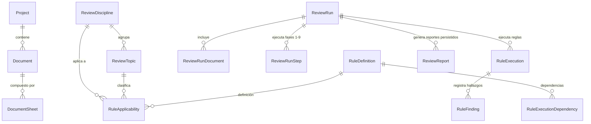

# One-Click Review por Especialidad y Punto de Revisión (QA/QC Orchestrator)

## 1. Visión General y Propósito

El sistema de **One-Click Review por Especialidad y Punto de Revisión** reemplaza las ejecuciones indiscriminadas y genéricas por un orquestador técnico y trazable que evalúa planos técnicos de ingeniería según un alcance claramente delimitado:

$$\text{Proyecto Activo} \longrightarrow \text{Especialidad (Discipline)} \longrightarrow \text{Punto de Revisión (Topic)} \longrightarrow \text{Documentos Aislados} \longrightarrow \text{Plan Topológico} \longrightarrow \text{Ejecución en 9 Fases} \longrightarrow \text{Hallazgos y Reporte Persistido}$$

### Principios Fundamentales
1. **Verdad Canónica de Aplicabilidad**: La relación entre reglas, especialidades y puntos de revisión se gestiona exclusivamente mediante la tabla `rule_applicabilities`, evitando arrays de texto o desincronizaciones en base de datos.
2. **Separación de Orquestación Técnica vs. Evaluación QA/QC**:
   - **Fases 1 a 4**: Preparación de datos, ingesta, OCR y extracción geométrica. No generan hallazgos normativos ficticios.
   - **Fases 5 a 8**: Evaluación secuencial y dependiente de reglas QA/QC.
   - **Fase 9**: Consolidación y emisión de reportes persistidos.
3. **Taxonomía Estructurada de "Not Evaluable"**: Si una regla no puede evaluarse, no se emite un error genérico ni un texto libre no analizable, sino un código estándar (`not_evaluable_reason_code`), mensaje estructurado, lista de requerimientos faltantes y acción recomendada para el usuario.
4. **Seguridad y Aislamiento Multi-Proyecto**: Los documentos se filtran estrictamente por pertenencia al proyecto activo (`Document.project_id == project.id` y `Document.status != 'archived'`). Nunca se evalúan ni exponen documentos ajenos.
5. **Diferenciación Estricta Sandbox vs. Production**:
   - En **Production**: solo se evalúan reglas activas con `source_status = 'approved'` y `RuleApplicability.approval_status = 'approved'`.
   - En **Sandbox**: se permite evaluar reglas en estado `proposed`, con una advertencia visual prominente y marcas de agua en los informes generados.

---

## 2. Modelo de Datos y Taxonomía Canónica

### Entidades Principales

- **`ReviewDiscipline`**: Especialidades de ingeniería (ej. `PIPING`, `ELECTRICAL`, `CIVIL_STRUCTURAL`, `INSTRUMENTATION_CONTROL`, `HVAC`, `GENERAL`).
- **`ReviewTopic`**: Puntos de revisión específicos asociados a una disciplina (ej. `PID_SYMBOLS`, `LINE_LIST_CONSISTENCY`, `ISOMETRIC_COMPLETENESS`, `VALVE_SCHEDULE_INTEGRITY`).
- **`RuleDefinition`**: Metadatos canónicos de la regla técnica:
  - `rule_scope`: `general` o `specialty`.
  - `execution_phase`: fase entera entre 1 y 9.
  - `priority`: orden de ejecución dentro de la fase.
  - `enabled` y `source_status`: `approved`, `proposed`, `draft`, `deprecated`.
  - `requires_data`: lista de requisitos documentales necesarios (`detected_symbols`, `legend_table`, `title_block`, etc.).
  - `applicable_document_types`: tipos de láminas aplicables (`P&ID`, `DIAGRAM`, `LEGEND`, `PLAN`).
- **`RuleApplicability`** *(Fuente de Verdad Canónica)*:
  - Relación `(rule_id, discipline_id, topic_id)`.
  - `applicability_role`: `primary`, `secondary`, `general`.
  - `source`: `human`, `ai_suggested`, `imported`.
  - `approval_status`: `approved`, `pending_review`, `rejected`.
  - `reviewed_by`, `rationale`, `confidence`.
- **`RuleExecutionDependency`**:
  - `rule_id` depende de `depends_on_rule_id`.
  - Si la regla previa no pasa (`passed` o `warning`), la regla dependiente produce un estado `not_evaluable` estructurado con código `RULE_DEPENDENCY_NOT_MET`.
- **`ReviewRunStep`**:
  - Traza la ejecución de las fases 1 a 9 con campos: `phase`, `phase_name`, `step_type`, `status` (`queued`, `running`, `succeeded`, `failed`, `skipped`), `summary_metrics`, `error_message`, `started_at`, `completed_at`.
- **`RuleExecution`**:
  - Resultado por regla evaluada: `status` (`passed`, `failed`, `warning`, `not_evaluable`, `skipped`, `error`), evidencia cuantitativa, resultado, razón de no evaluabilidad.
- **`ReviewReport`**:
  - Reporte persistido en disco y base de datos con formato (`json`, `xlsx`, `pdf`), `artifact_path`, `file_size_bytes`, y `sha256` inmutable.

---

## 3. Blueprint de las 9 Fases de Ejecución

| Fase | Nombre de la Fase | Tipo de Step | Propósito | ¿Genera Hallazgos QA/QC? |
| :---: | :--- | :--- | :--- | :---: |
| **1** | Ingesta y Resolución Documental | `preparation` | Filtrado y validación de pertenencia al proyecto activo. | No |
| **2** | Normalización de Láminas y Escalas | `normalization` | Verificación de rasterización, dimensiones px y mm. | No |
| **3** | Extracción OCR y Viñetas Técnicas | `extraction` | Extracción de metadatos de título, revisión y código. | No |
| **4** | Reconocimiento Gráfico y Simbología | `extraction` | Inferencia SAHI/YOLO y coincidencia de patrones. | No |
| **5** | Integridad Documental y Viñetas | `evaluation` | Evaluación de completitud general y títulos (`GEN-DOC-001`). | **Sí** |
| **6** | Simbología y Reconocimiento Normativo | `evaluation` | Reglas de especialidad (`SYM-UNKNOWN-001`, `SYM-AMBIGUOUS-001`, etc.). | **Sí** |
| **7** | Reconciliación Cruzada (Plano vs. Tablas) | `evaluation` | Cotejo de láminas contra cuadros de leyendas y listas. | **Sí** |
| **8** | Reglas Especializadas de Disciplina | `evaluation` | Comprobación de reglas avanzadas y dependencias. | **Sí** |
| **9** | Consolidación y Emisión de Reportes | `reporting` | Resumen ejecutivo y generación de artefactos exportables. | No |

---

## 4. Códigos Estructurados de "Not Evaluable"

Cuando una regla no dispone de datos suficientes para emitir un veredicto formal de cumplimiento o incumplimiento, devuelve `status = "not_evaluable"` con uno de los siguientes códigos estandarizados:

1. `NO_DOCUMENTS_SELECTED`: No se seleccionó ningún documento del proyecto para la revisión.
2. `REQUIRED_DOCUMENT_TYPE_MISSING`: El alcance requiere un tipo documental específico que no fue incluido (ej. lámina de leyendas para verificar consistencia).
3. `DOCUMENT_NOT_PROCESSED`: El documento seleccionado se encuentra en estado pendiente (`uploaded`) sin procesar.
4. `EXTRACTION_FAILED`: El pipeline de extracción gráfica o tabular no detectó datos evaluables en las láminas.
5. `NO_APPROVED_RULES`: El punto de revisión seleccionado no posee reglas aprobadas en el catálogo actual.
6. `MISSING_SYMBOL_CATALOG`: Falta la biblioteca de plantillas activas del estándar correspondiente.
7. `MISSING_REQUIRED_TAGS`: Falta la extracción previa de etiquetas de instrumentación o viñetas.
8. `RULE_DEPENDENCY_NOT_MET`: La regla predecesora requerida no se cumplió satisfactoriamente.
9. `INSUFFICIENT_CONFIDENCE`: Los niveles de confianza de las detecciones preliminares están por debajo del umbral mínimo de evaluación.
10. `USER_SCOPE_EXCLUDED`: La regla fue deshabilitada o excluida deliberadamente de la configuración de corrida.

Cada resultado incluye `recommended_action` orientando al ingeniero sobre cómo remediar la situación en la interfaz.

---

## 5. Alcance del MVP Productivo Habilitado

Para garantizar rigor y evitar falsas promesas técnicas:

- **Especialidad Habilitada**: `PIPING`
- **Punto de Revisión Habilitado**: `PID_SYMBOLS`
- **Reglas Aprobadas Habilitadas**:
  1. `SYM-UNKNOWN-001`: Detección de símbolos gráficos fuera del catálogo aprobado (ISA-5.1).
  2. `SYM-AMBIGUOUS-001`: Conflicto clasificatorio de símbolos (margen de confianza top-1 vs top-2 < 15%).
  3. `SYM-LEGEND-CONSISTENCY-001`: Consistencia entre símbolos dibujados y cuadro técnico de leyenda.
  4. `SYM-TAG-MISSING-001`: Presencia obligatoria de tags de identificación en válvulas y equipos.
  5. `GEN-DOC-001`: Verificación de integridad de viñeta técnica y metadatos del plano (regla general).

Todos los demás puntos de revisión (como `LINE_LIST_CONSISTENCY`, `ISOMETRIC_COMPLETENESS`, `PHILOSOPHY_CONTROL`, etc.) están registrados en la taxonomía para navegación y completitud del sistema, pero el orquestador responde determinísticamente:
> **"No hay reglas aprobadas para este alcance"** (`can_execute: false`).

---

## 6. Exportación Persistida de Auditoría

En lugar de endpoints efímeros que regeneran el reporte al vuelo, el sistema utiliza un flujo persistente y auditable:

1. **`POST /api/v1/review/runs/{run_id}/exports`**:
   - Genera el artefacto físico en el disco persistente (`storage/reports/{project_id}/...`).
   - Calcula el hash criptográfico `SHA-256` del archivo generado.
   - Registra una fila en `review_reports` con metadata inmutable de auditoría.
2. **`GET /api/v1/review/reports/{report_id}`**:
   - Consulta el estado, hash y detalles del reporte.
3. **`GET /api/v1/review/reports/{report_id}/download`**:
   - Descarga directa del archivo con headers seguros (`application/json`, `application/vnd.openxmlformats-officedocument.spreadsheetml.sheet`, `application/pdf`).

Formatos soportados:
- **JSON**: Payload estructurado completo para integraciones API y auditoría automatizada.
- **XLSX**: Planilla de cálculo con pestañas separadas para "Resumen Ejecutivo", "Fases de Orquestación", "Evaluación de Reglas" y "Hallazgos Técnicos" con coordenadas de bounding boxes.
- **PDF**: Documento vectorial corporativo con tipografía estandarizada, advertencia explícita en modo Sandbox y tabla de trazabilidad de integridad.
