# Arquitectura de Promoción de Reglas Candidatas a Baseline QA/QC del Sistema

## 1. Contexto y Causa Raíz del Problema

### El Bloqueador Funcional
En versiones anteriores, los documentos técnicos y normativos procesados a través del módulo de Intake generaban registros en `RuleDocument` y sus elementos asociados `RuleDocumentItem` (reglas candidatas, tablas, figuras y símbolos). Sin embargo:
1. Al pulsar "Aceptar" o validar el contenido de una regla candidata, esta quedaba únicamente marcada con estado `validada` en `rule_document_items`.
2. No existía un puente de dominio transaccional que convirtiera dicha regla candidata en una `RuleDefinition` viva en el catálogo de reglas del sistema, ni se creaba la correspondiente entrada aprobada en `RuleApplicability`.
3. En consecuencia, el motor de auditoría (`TaxonomyService.get_applicable_rules`), utilizado por el flujo **One-Click Review**, no encontraba estas reglas normativas al ejecutar la revisión sobre planos y proyectos.
4. Además, el etiquetado en la interfaz de usuario resultaba ambiguo: el botón "Aceptar" no distinguía entre confirmar la lectura/extracción de un documento y promover formalmente la regla al Baseline normativo.

---

## 2. Principios y Decisiones de Diseño

### 2.1 Esquema Exclusivamente Gestionado por Alembic
- Se prohíbe terminantemente la ejecución de DDL (`ALTER TABLE`, `CREATE TABLE`) desde `main.py` o scripts de arranque (startup hooks).
- Todos los cambios estructurales se aíslan en la migración lineal:
  - `migrations/versions/0031_rule_candidate_promotion_and_lineage.py`
  - Dependiente de la migración previa `0030_symbol_inventory_groups`.
  - Dispone de métodos `upgrade()` y `downgrade()` probados y funcionales para PostgreSQL.
- Campos incorporados:
  - En `rule_definitions`: `source_candidate_id`, `source_document_id`, `source_page`, `source_bbox`, `source_excerpt`, `source_hash`, `source_status`.
  - En `rule_document_items`: `promoted_rule_definition_id`, `promoted_at`, `promoted_by`, `promotion_status`, `promotion_error`.
  - En `rule_review_decisions`: `before_snapshot`, `after_snapshot`.

### 2.2 Servicio Único de Dominio: `RulePromotionService`
Toda la lógica de negocio para la promoción reside exclusivamente en:
`RulePromotionService.promote_candidate(...)` (`backend/app/services/rules/promotion_service.py`).

Tanto el endpoint individual (`POST /api/v1/rule-candidates/{candidate_id}/promote`) como la promoción masiva por documento (`POST /api/v1/rule-documents/{doc_id}/promote-to-baseline`) delegan su ejecución a este único servicio. Esto previene divergencias en:
- Validación de permisos RBAC y aislamiento de Tenant (`organization_id`).
- Normalización e idempotencia de códigos de regla (`rule_code`).
- Derivación inmutable de la fuente.
- Creación de `RuleDefinition`, `RuleApplicability` y auditoría en `RuleReviewDecision`.
- Transaccionalidad atómica y rollback ante errores.

### 2.3 Linaje de Fuente Inmutable Derivado de Base de Datos
El frontend **no** puede dictar arbitrariamente la fuente, el hash ni la ubicación del candidato:
- El backend lee directamente el `RuleDocumentItem` y su `RuleDocument` asociado en la base de datos.
- Se extrae:
  - `source_document_id`: ID del documento normativo en DB.
  - `source_document_title`: Título oficial del documento.
  - `source_page`: Número de página extraído en metadatos.
  - `source_bbox`: Bounding box original de la extracción.
  - `source_excerpt`: Texto o extracto literal original del documento.
  - `source_hash`: Hash SHA256 derivado del extracto original.
- Se registra una instantánea inmutable en `RuleReviewDecision`:
  - `before_snapshot`: Estado del candidato antes de la promoción.
  - `after_snapshot`: Definición de la regla resultante, taxonomía, aplicabilidad y parámetros creados.

### 2.4 Taxonomía Validada y Gobernanza
El motor no admite disciplinas ni tópicos huérfanos o no homologados:
- Se valida la existencia y estado activo de la disciplina en la tabla `disciplines`.
- Se normalizan alias de disciplinas en español (e.g. `ARQUITECTURA` -> `ARCHITECTURE`, `ESTRUCTURAS` -> `STRUCTURES`).
- Si la base de datos no contiene el catálogo de taxonomía inicial, se invoca de manera transparente `TaxonomyService.seed_taxonomy_and_rules(db)`.
- El tópico debe pertenecer a la disciplina seleccionada.
- Se verifica la fase de ejecución (`execution_phase`) válida.
- La fuente canónica de aplicabilidad es `RuleApplicability`, generada con:
  - `applicability_role = 'primary'` (vocabulario unificado: `primary`, `secondary`, `general`)
  - `approval_status = 'approved'` (para promoción activa) o `'proposed'` / `'pending'` (para promoción a revisión).
- **Validación Estricta de Compatibilidad:**
  - Si un tópico es específico (no transversal) y no pertenece a la disciplina seleccionada, el backend rechaza la solicitud con `HTTP 422 Unprocessable Entity`.
  - No se crea `RuleDefinition`, no se crea `RuleApplicability`, no se altera `RuleCandidate` ni se registra decisión de aprobación ante combinaciones incompatibles.

### 2.5 Exclusión Estricta de Símbolos
- Los símbolos (`item_type in ('symbol', 'symbol_template', 'legend_symbol')`) **nunca** son promovidos a `RuleDefinition`.
- La promoción de simbología cuenta con su propio flujo HITL hacia `SymbolTemplate` y `SymbolOccurrence` a través del `SymbolCurationStudioModal`.
- Si se intenta promover un candidato de tipo símbolo a través de este servicio, se levanta una excepción `HTTPException(400, "Los símbolos no pueden ser promovidos como RuleDefinition...")`.

---

## 3. Matriz de Estados de Ciclo de Vida

| Entidad | Estado | Significado |
| :--- | :--- | :--- |
| **RuleCandidate** | `pending` | Extraído de Intake, pendiente de validación o promoción. |
| **RuleCandidate** | `promoted_draft` | Promovido para revisión técnica preliminar (por Auditor). |
| **RuleCandidate** | `promoted` | Promovido y activado en Baseline QA/QC (por Admin / Audit Lead). |
| **RuleCandidate** | `rejected` | Rechazado con justificación técnica archivada en `RuleReviewDecision`. |
| **RuleCandidate** | `superseded` | Reemplazado por una versión posterior del documento. |
| **RuleDefinition** | `draft` | Creado preliminarmente sin activación en el motor. |
| **RuleDefinition** | `baseline_pending_approval` | Pendiente de aprobación formal de Baseline. |
| **RuleDefinition** | `baseline_active` | **Activo en el motor QA/QC**; visible para One-Click Review. |
| **RuleDefinition** | `disabled` | Deshabilitado temporalmente. |
| **RuleDefinition** | `superseded` | Reemplazado por una nueva versión de regla. |

---

## 4. Política de Roles y RBAC

| Rol | Acción Permitida | Estado Resultante en RuleDefinition | Estado en RuleApplicability |
| :--- | :--- | :--- | :--- |
| **Viewer** | Ninguna (solo lectura) | Error `403 Forbidden` | N/A |
| **Auditor** | "Promover para revisión" | `draft` / `baseline_pending_approval` | `pending` |
| **Audit Lead** | "Promover y activar en Baseline" | `baseline_active` (`is_active=True`, `enabled=True`) | `approved` |
| **Admin** | "Promover y activar en Baseline" | `baseline_active` (`is_active=True`, `enabled=True`) | `approved` |

---

## 5. Diagrama de Flujo de Promoción

```mermaid
sequenceDiagram
    autonumber
    actor User as Usuario (Admin / Auditor)
    participant UI as Frontend (Modal de Contenido / RulesPage)
    participant API as API Endpoints (/rule-candidates/{id}/promote)
    participant Svc as RulePromotionService
    participant DB as Base de Datos (PostgreSQL)
    participant Tax as TaxonomyService & Baseline

    User->>UI: Solicita "Promover a Baseline QA/QC"
    UI->>API: POST /rule-candidates/{id}/promote (con payload de curación y headers RBAC)
    API->>Svc: promote_candidate(db, candidate_id, payload, user_id, user_role, org_id)
    
    rect rgb(20, 25, 40)
        Note over Svc,DB: Transacción Atómica
        Svc->>DB: Bloquear y obtener RuleDocumentItem + RuleDocument
        Svc->>Svc: Validar que no sea símbolo (guard rail)
        Svc->>Svc: Derivar linaje inmutable (título, página, hash, extracto)
        Svc->>Svc: Validar taxonomía (Disciplina activa, tópico correspondiente)
        Svc->>DB: Verificar unicidad / colisión de rule_code en la Organización
        Svc->>DB: Crear/Actualizar RuleDefinition (según RBAC: baseline_active)
        Svc->>DB: Crear/Actualizar RuleApplicability (approval_status: approved)
        Svc->>DB: Registrar RuleReviewDecision con before y after snapshot
        Svc->>DB: Actualizar estado de RuleDocumentItem a 'promoted' y RuleDocument
    end
    
    DB-->>Svc: Commit exitoso
    Svc-->>API: RulePromotionResult
    API-->>UI: 200 OK (RuleDefinition + Lineage)
    UI->>UI: Actualiza estado local e invalida cachés
    UI->>Tax: One-Click Review invoca get_applicable_rules()
    Tax-->>UI: La nueva regla es evaluada sobre los planos del proyecto
```

