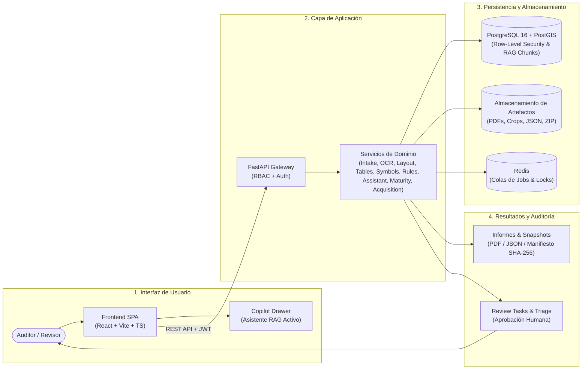

# Plan Review AI Hybrid — Manual Maestro y Paquete Documental

> **Versión del Sistema**: 0.3.0 (Fase 3: Seguridad Multi-Tenant, RAG Activo, Adquisición Web con Permiso & Suficiencia Informacional)  
> **Fecha de Documentación**: Agosto 2026  
> **Clasificación**: Documentación Técnica y Operativa Oficial  
> **Propósito**: Guía integral de arquitectura, instalación, operación, modos de ejecución, gobernanza del asistente y flujos gráficos de revisión de planos técnicos PDF.

---

## 1. Mapa General del Sistema y Flujo End-to-End

El sistema **Plan Review AI Hybrid** combina procesamiento perceptual (visión computacional, OCR y extracción de geometrías) con un motor determinístico de reglas normativas (QA/QC) y un Asistente Operacional gobernado por RAG, garantizando trazabilidad total, evidencia auditable y participación humana en el ciclo (*Human-In-The-Loop*).



---

## 2. Estructura del Paquete Documental Oficial

El paquete documental está compuesto por **tres documentos maestros principales** y **ocho guías modulares especializadas**:

### Documentos Maestros Principales
1. **[Manual de Usuario (manual_usuario.md)](file:///c:/Users/Windows/OneDrive/Estructura%20Proyectos/plan-review-ai-hybrid/docs/manuals/manual_usuario.md):** Manual práctico, directo y no técnico para auditores, revisores y jefes de proyecto.
2. **[Manual Técnico y Operativo (manual_tecnico_operativo.md)](file:///c:/Users/Windows/OneDrive/Estructura%20Proyectos/plan-review-ai-hybrid/docs/manuals/manual_tecnico_operativo.md):** Arquitectura detallada, modelo de datos, gobernanza en 13 dominios y 8 estados, RAG activo, routing multi-tier, adquisición web con scoring matemático y matriz de estado real.
3. **[Documento de Diagramas de Flujo del Asistente (assistant_flow_diagrams.md)](file:///c:/Users/Windows/OneDrive/Estructura%20Proyectos/plan-review-ai-hybrid/docs/manuals/assistant_flow_diagrams.md):** 14 diagramas de flujo completos en Mermaid que cubren desde el intake hasta los cortes de etapa y la reutilización de lecciones aprendidas.

### Guías Modulares Especializadas
```
docs/manuals/
├── 00_indice_maestro.md                                                (Este índice y mapa maestro)
├── 01_filosofia_y_funcionamiento_del_sistema.md                        (Filosofía híbrida, IA vs Reglas, límites)
├── 02_manual_de_usuario_y_operacion.md                                 (Operación detallada de interfaz y triage)
├── 03_stack_tecnologico_y_programas_utilizados.md                      (Programas, librerías, dependencias)
├── 04_arquitectura_estructura_de_carpetas_y_relacion_entre_modulos.md (Estructura de código y flujo interno)
├── 05_instalacion_configuracion_y_puesta_en_marcha.md                  (Guía paso a paso de despliegue y puesta en marcha)
├── 06_modo_con_ia_modo_sin_ia_y_como_aprende.md                        (Modos de operación, IA vs Heurística, Active Learning)
├── 07_seguridad_multi_tenant_rbac_y_requisitos_para_funcionar.md       (PostgreSQL RLS, JWT, Roles, Aislamiento)
└── 08_troubleshooting_checklists_y_comandos_frecuentes.md             (Diagnóstico de errores, runbooks y comandos)
```

---

## 3. Matriz de Audiencia y Rutas de Lectura Recomendadas

| Documento | Perfil Principal | Perfil Secundario | Objetivo de la Lectura |
| :--- | :--- | :--- | :--- |
| **[Manual de Usuario](file:///c:/Users/Windows/OneDrive/Estructura%20Proyectos/plan-review-ai-hybrid/docs/manuals/manual_usuario.md)** | Auditores, Revisores Técnicos, Arquitectos | Jefes de Proyecto | Aprender a usar el sistema y el asistente sin entrar en tecnicismos. |
| **[Manual Técnico / Operativo](file:///c:/Users/Windows/OneDrive/Estructura%20Proyectos/plan-review-ai-hybrid/docs/manuals/manual_tecnico_operativo.md)** | Arquitectos de Software, Líderes Técnicos | Desarrolladores Backend | Comprender la arquitectura de servicios, base de conocimiento, routing y madurez. |
| **[Diagramas de Flujo del Asistente](file:///c:/Users/Windows/OneDrive/Estructura%20Proyectos/plan-review-ai-hybrid/docs/manuals/assistant_flow_diagrams.md)** | Desarrolladores, Auditores QA | Todos los perfiles | Visualizar gráficamente los 14 flujos de decisión y aprendizaje del sistema. |
| **[05. Instalación y Puesta en Marcha](file:///c:/Users/Windows/OneDrive/Estructura%20Proyectos/plan-review-ai-hybrid/docs/manuals/05_instalacion_configuracion_y_puesta_en_marcha.md)** | DevOps, Operadores Técnicos | Desarrolladores | Desplegar la plataforma en local o producción con Docker. |
| **[08. Troubleshooting y Runbooks](file:///c:/Users/Windows/OneDrive/Estructura%20Proyectos/plan-review-ai-hybrid/docs/manuals/08_troubleshooting_checklists_y_comandos_frecuentes.md)** | Soporte Técnico, Operadores | Todos los perfiles | Resolver incidencias, bloqueos de Gatekeeper y errores de ejecución. |
