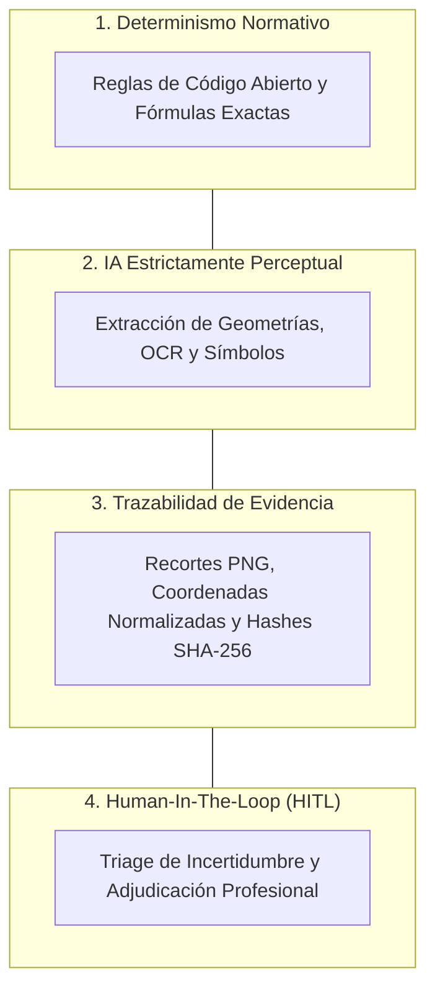

# Plan Review AI Hybrid — Filosofía y Funcionamiento del Sistema

> **Documento**: 01_filosofia_y_funcionamiento_del_sistema.md  
> **Audiencia**: Auditores, Jefes de Proyecto, Arquitectos de Software, Desarrolladores  
> **Propósito**: Explicar los fundamentos conceptuales, el flujo de ejecución interno y los límites reales del sistema.

---

## 1. ¿Qué es Plan Review AI Hybrid?

**Plan Review AI Hybrid** es una plataforma tecnológica especializada en la **auditoría técnica, verificación normativa y aseguramiento de calidad (QA/QC) sobre planos y láminas técnicas de arquitectura e ingeniería en formato PDF**.

A diferencia de las herramientas tradicionales de procesamiento de documentos o los asistentes basados exclusivamente en modelos de lenguaje (LLMs), el sistema está diseñado bajo un **paradigma híbrido estricto**:
- **La Inteligencia Artificial (Visión por Computadora y OCR)** se utiliza exclusivamente como **capa perceptual** para extraer información visual estructurada (textos, recuadros, tablas, cotas y simbología gráfica).
- **El Motor de Reglas Determinísticas** se encarga de la evaluación de cumplimiento normativo (e.g., Ordenanza General de Urbanismo y Construcciones - OGUC, estándares de dibujo y consistencia cruzada).
- **El Auditor Humano (Human-In-The-Loop)** actúa como la autoridad final de decisión ante casos de incertidumbre perceptual o discrepancias normativas.

---

## 2. El Problema que Resuelve

La revisión manual de proyectos de edificación enfrenta tres cuellos de botella críticos:

```
┌─────────────────────────┐     ┌─────────────────────────┐     ┌─────────────────────────┐
│     FATIGA HUMANA       │     │   FALTA DE EVIDENCIA    │     │   RIESGO DE "LLM-ONLY"  │
│ Cientos de láminas A0   │ ──> │ Observaciones subjetivas│ ──> │ Alucinaciones de datos, │
│ generan omisiones en    │     │ sin recorte visual ni   │     │ falta de reproducibilidad│
│ cálculos repetitivos.   │     │ trazabilidad de norma.  │     │ y cajas negras sin ley. │
└─────────────────────────┘     └─────────────────────────┘     └─────────────────────────┘
```

1. **Omisión por Saturación Cognitiva**: Verificación repetitiva de conteo de puertas, anchos mínimos de escape, cuadros de superficies y concordancia entre viñetas y planos.
2. **Falta de Trazabilidad y Evidencia Auditable**: Las observaciones de revisión suelen anotarse en planillas informales sin vincular el fragmento visual exacto del plano que originó la no-conformidad.
3. **Peligros de los Enfoques "Puros de IA" (Generativos)**: Un modelo de lenguaje generativo puede inventar dimensiones, omitir decimales en tablas técnicas o aprobar planos inexistentes. En ingeniería y arquitectura, **una decisión no puede basarse en una alucinación estadística**.

---

## 3. Principios Fundamentales del Sistema



### A. Reglas Determinísticas Primero (*Rule-First*)
Las decisiones de auditoría no se dejan al arbitrio de un modelo generativo. Si la norma exige que el ancho mínimo de una escalera de evacuación sea $1.20\text{ m}$, el sistema mide la cota extraída, la compara contra la regla codificada y emite un veredicto binario o una desviación cuantificada.

### B. La IA como Sensor, no como Juez
Los modelos de visión (OCR, YOLO, segmentación de regiones) funcionan como "sensores". Su trabajo es responder: *¿Qué texto está escrito aquí?*, *¿Dónde está la viñeta?*, *¿Cuántos símbolos de extintor hay en este cuadrante?*. La IA jamás decide si un plano es legal o ilegal.

### C. Evidencia Visual e Inmutable
Cada hallazgo (*RuleFinding*) incluye obligatoriamente:
- Coordenadas normalizadas $[x_0, y_0, x_1, y_1]$ en la lámina.
- Recorte visual en alta resolución (crop rasterizado a 300 DPI).
- Valor medido vs. Valor exigido.
- Artículo normativo o criterio técnico de referencia.
- Hash SHA-256 del archivo fuente para evitar alteraciones.

### D. Reproducibilidad Científica
Si se procesa el mismo plano con la misma versión del paquete normativo y el mismo umbral de inferencia, **el sistema siempre genera exactamente el mismo informe**.

---

## 4. Flujo de Ejecución Interno Paso a Paso

El pipeline integral se ejecuta en 8 etapas estructuradas:

```
[1. Intake / Ingest] ──> [2. OCR Espacial] ──> [3. Layout Macro] ──> [4. Title Block]
                                                                            │
[8. Reportes / Bundle] <── [7. Reglas QA/QC] <── [6. Símbolos] <── [5. Tablas]
```

1. **Intake & Gobierno de Fuentes**: Registro del PDF, cálculo de su hash SHA-256 inmutable, clasificación de procedencia (`consented`, `anonymized`, `synthetic`) y vinculación al proyecto.
2. **Ingesta & Rasterizado Dual**: Extracción del árbol de objetos vectoriales nativos con PyMuPDF / pdfplumber y generación paralela de imagen rasterizada a alta resolución (300 DPI) para análisis visual.
3. **OCR Espacial**: Detección de texto con preservación estricta de coordenadas $[x_0, y_0, x_1, y_1]$ y rotación de caracteres.
4. **Segmentación de Layout Macro-Regional**: Clasificación del espacio de la lámina en macro-regiones: `drawing_area` (área de dibujo), `title_block` (viñeta), `table_candidate` (cuadros técnicos), `notes_area` (notas generales) y `margins`.
5. **Extracción y Validación de Viñeta (*Title Block*)**: Identificación de campos críticos de encabezado: código de lámina, título del plano, escalas, fecha, arquitecto responsable y número de revisión.
6. **Extracción Tabular Profunda**: Reconstrucción de la malla de filas y columnas en cuadros de superficies, cuadros de puertas/ventanas y especificaciones técnicas, normalizando unidades de medida ($m, m^2, cm, mm$).
7. **Detección de Símbolos Visuales**: Identificación y conteo de componentes arquitectónicos e instalaciones (puertas, ventanas, columnas, artefactos) sobre el área de dibujo.
8. **Motor de Reglas QA/QC & Conciliación Cruzada**: Cruce automático entre tablas y dibujo (e.g., verificar si las 12 puertas $P-1$ declaradas en el cuadro coinciden con las 12 puertas graficadas en la planta).
9. **Triage Humano (*Review Tasks*)**: Si una cota o texto posee un nivel de confianza bajo ($< 0.70$), el sistema no adivina: crea una tarea de revisión humana en la bandeja del auditor.
10. **Generación de Reportes Técnicos**: Compilación determinística del informe en PDF y JSON con evidencias incrustadas y empaquetado reproducible en archivo ZIP (*Audit Bundle*).

---

## 5. Tabla de Entrada / Proceso / Salida

| Etapa | Entrada Principal | Proceso Realizado | Salida Generada |
| :--- | :--- | :--- | :--- |
| **Intake** | Archivo PDF del plano | Validación de integridad, SHA-256 y metadatos | `SourceAsset` registrado |
| **Ingesta** | `SourceAsset` | Rasterizado a 300 DPI y extracción vectorial | `Document` y `DocumentSheet` |
| **OCR** | Lámina rasterizada | Reconocimiento de texto y bounding boxes | Colección de `ExtractedText` |
| **Layout** | Coordenadas y geometrías | Clasificación de zonas del plano | Polígonos de `SheetRegion` |
| **Viñeta** | Región `title_block` | Normalización de campos clave (escala, código) | Registro `TitleBlockExtraction` |
| **Tablas** | Región `table_candidate` | Detección de celdas, encabezados y unidades | `ExtractedTable` y `ExtractedTableCell` |
| **Símbolos** | Región `drawing_area` | Detección visual y conteo por clase | Colección de `DetectedSymbol` |
| **Reglas** | Textos, tablas y símbolos | Evaluación contra fórmulas normativas | Colección de `RuleFinding` |
| **HITL** | Hallazgos con baja confianza | Intervención del auditor (Aprobar/Descartar) | Registro `FindingResolution` |
| **Reporte** | Hallazgos y evidencias | Renderizado determinístico WeasyPrint / JSON | `AuditReport` y ZIP con Manifiesto |

---

## 6. Automático vs. Revisión Humana

| Capacidad | Automatizado por el Sistema | Requiere Revisión Humana (HITL) |
| :--- | :--- | :--- |
| **Conteo de Elementos** | Conteo sistemático en segundos de miles de símbolos. | Verificación de símbolos atípicos, rotos o superpuestos. |
| **Lectura de Tablas** | Reconstrucción de cuadrículas y suma de m². | Celdas ilegibles por compresión de escaneo deficiente. |
| **Cruce Tabla vs Plano** | Conciliación de cantidades declaradas vs dibujadas. | Justificación técnica de excepciones de proyecto. |
| **Cálculos Matemáticos** | Validación de fórmulas de ocupación y porcentajes. | Criterio de equivalencia de materiales especiales. |
| **Emisión de Reporte** | Compilación de evidencias, recortes y manifiesto. | Firma y validación de responsabilidad profesional. |

---

## 7. Declaración de Responsabilidad Profesional

> [!CAUTION]
> **AVISO LEGAL Y TÉCNICO OBLIGATORIO**:  
> **El software Plan Review AI Hybrid es una herramienta de asistencia y apoyo al diagnóstico técnico.**  
> En ningún caso el sistema reemplaza el criterio, cálculo, firma o responsabilidad legal del arquitecto, ingeniero calculista, revisor independiente o director de obras.  
> Los reportes generados deben ser siempre validados por un profesional calificado antes de ser presentados ante organismos públicos o utilizados en obras de construcción.

---

## 8. Límites Reales del Sistema

### Lo que el sistema HACE con alta precisión:
- Detectar omisiones en cuadros técnicos y tablas de especificaciones.
- Encontrar discrepancias numéricas entre lo escrito en la viñeta y el contenido del plano.
- Identificar textos normativos obligatorios ausentes en la lámina.
- Alertar sobre cotas inferiores al estándar normativo configurado.
- Generar un expediente de auditoría transparente y auditable con recortes visuales.

### Lo que el sistema NO HACE:
- No interpreta intenciones de diseño arquitectónico no graficadas.
- No realiza cálculos estructurales por elementos finitos (FEA).
- No asume información faltante; si un dato no está en el plano, emite estado `insufficient_evidence`.
- No inventa justificaciones jurídicas ante interpretaciones ambiguas de la ley.
