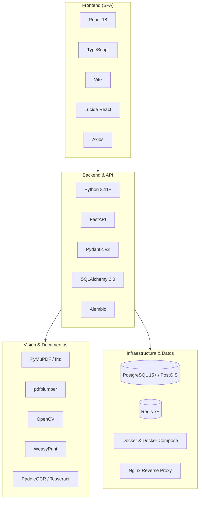

# Plan Review AI Hybrid — Stack Tecnológico y Programas Utilizados

> **Documento**: 03_stack_tecnologico_y_programas_utilizados.md  
> **Audiencia**: Ingenieros DevOps, Desarrolladores Backend/Frontend, Administradores de Sistemas  
> **Propósito**: Detallar el inventario de software, dependencias y herramientas utilizadas en el desarrollo y despliegue del sistema.

---

## 1. Inventario y Matriz de Tecnologías

---

## 2. Tabla Comparativa de Tecnologías

| Tecnología | Rol y Función en el Sistema | Carácter | Entorno de Uso |
| :--- | :--- | :--- | :--- |
| **Python 3.11+** | Lenguaje principal del backend, lógica de reglas y procesamiento numérico. | **Obligatorio** | Desarrollo y Producción |
| **FastAPI** | Framework web asíncrono para la exposición de la REST API y validación de esquemas. | **Obligatorio** | Desarrollo y Producción |
| **SQLAlchemy 2.0** | ORM para mapeo de entidades, transacciones y consultas relacionales. | **Obligatorio** | Desarrollo y Producción |
| **Alembic** | Gestor de migraciones y versionado incremental de la base de datos. | **Obligatorio** | Desarrollo y Producción |
| **PostgreSQL 15+** | Motor de base de datos relacional principal con soporte de **Row-Level Security (RLS)**. | **Obligatorio en Prod** / Recomendado en Dev | Producción e Integración |
| **PostGIS (Extensión)**| Soporte para indexación espacial y consultas geométricas avanzadas. | **Recomendado** | Producción |
| **SQLite (In-Memory)** | Base de datos liviana embebida utilizada exclusivamente para tests unitarios rápidos. | **Opcional / Dev** | Solo Pruebas Rápidas |
| **React 18** | Biblioteca para la interfaz de usuario tipo Single Page Application (SPA). | **Obligatorio** | Desarrollo y Producción |
| **TypeScript** | Tipado estricto en frontend para interfaces de API, DTOs y modelos de datos. | **Obligatorio** | Desarrollo y Producción |
| **Vite** | Bundler y servidor de desarrollo ultra-rápido para la SPA. | **Obligatorio** | Desarrollo y Producción |
| **Redis 7+** | Broker de mensajería para jobs asíncronos y sistema de distributed locks. | **Obligatorio en Prod** / Opcional en Dev Local | Producción |
| **PyMuPDF (fitz)** | Renderizado rasterizado de páginas a 300 DPI y lectura de primitivas PDF. | **Obligatorio** | Desarrollo y Producción |
| **pdfplumber** | Extracción estructurada de tablas, texto y líneas vectoriales de alta precisión. | **Obligatorio** | Desarrollo y Producción |
| **OpenCV (cv2)** | Operaciones de visión artificial, transformaciones morfológicas y preprocesamiento. | **Obligatorio** | Desarrollo y Producción |
| **WeasyPrint** | Motor de renderizado determinístico HTML/CSS a PDF para reportes de auditoría. | **Obligatorio** | Desarrollo y Producción |
| **PaddleOCR / Tesseract**| Motores de OCR para extracción de texto en áreas rasterizadas o escaneadas. | **Recomendado** (Modo con IA) | Desarrollo y Producción |
| **Pydantic v2** | Validación estricta de payloads, DTOs y JSON Schemas versionados. | **Obligatorio** | Desarrollo y Producción |
| **Argon2id** | Algoritmo criptográfico de hashing de contraseñas de alta seguridad. | **Obligatorio** | Desarrollo y Producción |
| **Docker & Compose** | Contenedorización reproducible de servicios (Postgres, Redis, API, UI). | **Recomendado** | Desarrollo y Producción |
| **Nginx** | Reverse proxy para terminación SSL/TLS, compresión Gzip y balanceo. | **Recomendado** | Producción |

---

## 3. Entorno Mínimo Local vs. Entorno Productivo Controlado

### A. Entorno Mínimo para Desarrollo Local (Desarrollador individual)
- **Host**: Windows 10/11, Linux (Ubuntu 22.04+) o macOS (Apple Silicon/Intel).
- **Procesador**: 4 núcleos CPU.
- **Memoria RAM**: 8 GB mínimo (16 GB recomendado si se ejecutan modelos OCR en memoria).
- **Almacenamiento**: 10 GB de espacio libre en disco.
- **Software Base**:
  - Python 3.11 o superior.
  - Node.js 18 LTS o 20 LTS (con npm).
  - Git.
  - Docker Desktop (opcional si se levantan servicios manualmente).

### B. Entorno Recomendado para Producción Controlada
- **Host**: Servidor dedicado o máquina virtual Linux (Ubuntu Server 22.04 LTS / Debian 12).
- **Procesador**: 8 vCPUs o superior.
- **Memoria RAM**: 16 GB a 32 GB RAM (garantiza buffer para rasterizado concurrente de múltiples láminas A0).
- **Aceleración Gráfica (Opcional)**: GPU NVIDIA con CUDA 12+ (acelera inferencia OCR y YOLO en lotes grandes).
- **Almacenamiento**: 100 GB SSD NVMe con esquema de volúmenes persistentes y backups automatizados.
- **Topología de Red**:
  - Reverse proxy Nginx o Traefik con certificado SSL/TLS (Let's Encrypt / Certbot).
  - Red interna Docker aislada para base de datos y Redis (sin exponer puertos 5432 ni 6379 a internet).
