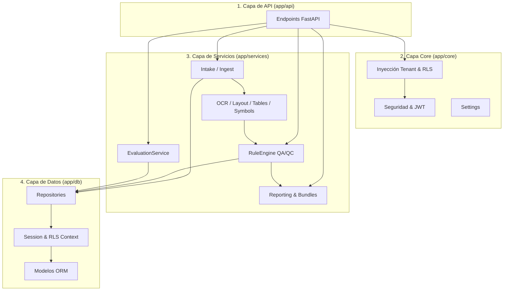

# Plan Review AI Hybrid — Arquitectura, Estructura de Carpetas y Relación entre Módulos

> **Documento**: 04_arquitectura_estructura_de_carpetas_y_relacion_entre_modulos.md  
> **Audiencia**: Desarrolladores Fullstack, Arquitectos de Software, Auditores de Código  
> **Propósito**: Describir la organización del repositorio, la jerarquía de dependencias y el flujo de llamadas interno.

---

## 1. Árbol de Directorios del Proyecto

```
plan-review-ai-hybrid/
├── backend/
│   ├── app/
│   │   ├── api/v1/endpoints/        # Controladores REST organizados por dominio
│   │   │   ├── auth.py              # Autenticación, login y perfil
│   │   │   ├── organizations.py     # Gestión de organizaciones y membresías
│   │   │   ├── intake.py            # Recepción de PDFs y SourceAssets
│   │   │   ├── pipelines.py         # Orquestación One-Click Review
│   │   │   ├── evaluations.py       # Golden Datasets y corridas de evaluación
│   │   │   ├── reports.py           # Generación y descarga de informes
│   │   │   ├── review_tasks.py      # Triage humano (HITL)
│   │   │   └── ...
│   │   ├── core/                    # Configuraciones, seguridad y middlewares
│   │   │   ├── config.py            # Variables de entorno con Pydantic Settings
│   │   │   ├── security.py          # Hashing Argon2id, firmado/validación JWT
│   │   │   ├── deps.py              # Inyección de dependencias y contexto Tenant/RLS
│   │   │   └── logging.py           # Sistema centralizado de logs estructurados
│   │   ├── db/                      # Capa de acceso a datos
│   │   │   ├── models/              # Modelos declarativos SQLAlchemy
│   │   │   │   ├── core.py          # User, Organization, Project, AuditLog
│   │   │   │   ├── intake.py        # SourceAsset
│   │   │   │   ├── document_memory.py # Document, DocumentSheet, ExtractedText, etc.
│   │   │   │   ├── decision_memory.py # RuleDefinition, RuleFinding, Resolution
│   │   │   │   ├── reporting.py     # AuditReport, EvidenceManifest
│   │   │   │   └── evaluation.py    # EvaluationDataset, Sample, AnnotationSet, Run
│   │   │   ├── repositories/        # Consultas encapsuladas de base de datos
│   │   │   └── session.py           # Engine de base de datos y SessionLocal
│   │   ├── schemas/                 # DTOs Pydantic y JSON Schemas versionados
│   │   └── services/                # Lógica de negocio pura y motores especializados
│   │       ├── intake/              # Validación y registro de archivos
│   │       ├── ingest/              # Rasterizado dual y extracción vectorial
│   │       ├── ocr/                 # OCR espacial y bounding boxes
│   │       ├── layout/              # Segmentación macro-regional
│   │       ├── tables/              # Extracción tabular profunda
│   │       ├── symbols/             # Detección de simbología técnica
│   │       ├── rules/               # Motor de reglas determinísticas QA/QC
│   │       ├── evaluation/          # Benchmarking, Golden Datasets y métricas
│   │       └── reporting/           # Renderizado WeasyPrint y Evidence Bundles
│   └── tests/                       # Suites automatizadas
│       ├── unit/                    # Tests unitarios rápidos en memoria
│       ├── integration/             # Tests contra PostgreSQL 15+ con RLS real
│       └── e2e/                     # Pruebas de flujo completo
├── frontend/
│   ├── src/
│   │   ├── components/              # Navbar, Sidebar, Visor de Planos, Modales
│   │   ├── pages/                   # Vistas principales de la aplicación
│   │   │   ├── LoginPage.tsx        # Login con soporte multi-organización
│   │   │   ├── PipelinePage.tsx     # One-Click Review
│   │   │   ├── EvaluationPage.tsx   # Scorecard y Golden Dataset
│   │   │   └── ...
│   │   ├── services/                # Cliente Axios con interceptores de tenant
│   │   └── types/                   # Interfaces TypeScript sincronizadas con Backend
├── migrations/                      # Scripts Alembic para evolución de esquema
├── data/                            # Almacén local de artefactos, reportes y datasets
├── scripts/                         # Utilidades operativas y seeders
├── docker-compose.yml               # Orquestación de entorno completo
└── README.md                        # Documentación general y guías de inicio
```

---

## 2. Responsabilidades por Capa y Matriz de Dependencias



| Módulo / Capa | Responsabilidad Principal | Depende Directamente de |
| :--- | :--- | :--- |
| **`app/api/v1`** | Recibir peticiones HTTP, validar DTOs de entrada y autenticar. | `app/core/deps`, `app/schemas`, `app/services` |
| **`app/core`** | Proveer configuración, firmado criptográfico y validación de tenant. | Ninguno (Capa base transversal) |
| **`app/schemas`** | Definir contratos JSON y esquemas de validación de negocio. | Pydantic |
| **`app/services`** | Implementar la lógica del pipeline, algoritmos y reglas. | `app/db/repositories`, `app/core/logging` |
| **`app/db/models`**| Mapeo relacional de base de datos y llaves foráneas. | SQLAlchemy |
| **`app/db/repositories`**| Consultas parametrizadas y aislamiento de transacciones. | `app/db/session`, `app/db/models` |

---

## 3. Ciclo de Vida de una Petición (Ejemplo: Carga y Revisión de Lámina)

```
[Usuario / SPA]
       │  (1) POST /api/v1/pipelines/run
       │      Headers: Authorization: Bearer <JWT>, X-Organization-Id: <OrgUUID>
       ▼
[FastAPI Gateway]
       │  (2) Valida JWT y membresía activa del usuario en la Organización
       │  (3) Abre transacción en DB y ejecuta: SELECT set_config('app.current_organization_id', :org_id, true)
       ▼
[PipelineService]
       │  (4) Adquiere lock de concurrencia sobre el documento
       │  (5) Llama a Ingest -> OCR -> Layout -> TitleBlock -> Tables -> Symbols
       │  (6) Invoca a RuleEngine con los datos estructurados extraídos
       ▼
[RuleEngine]
       │  (7) Ejecuta reglas determinísticas de código abierto
       │  (8) Genera RuleFindings y asigna recortes visuales PNG
       ▼
[ReportingService]
       │  (9) Renderiza AuditReport en PDF mediante WeasyPrint
       │  (10) Empaqueta evidencias en ./data/reports/<id>/bundle.zip con manifiesto SHA-256
       ▼
[Respuesta JSON] ──> Retorna estado 'completed' y resumen de hallazgos a la SPA
```

---

## 4. Estructura de Almacenamiento de Artefactos en Disco

Todos los archivos binarios generados se almacenan bajo la carpeta `./data/` con rutas versionadas y organizadas por dominio:

```
data/
├── uploads/             # PDFs originales subidos por los usuarios (<source_asset_id>.pdf)
├── rasterized/          # Imágenes de páginas completas renderizadas a 300 DPI (<sheet_id>.png)
├── crops/               # Recortes visuales de hallazgos (<finding_id>_crop.png)
├── reports/             # Informes finales generados
│   └── <report_id>/
│       ├── report.pdf   # Informe técnico en formato PDF imprimible
│       ├── report.json  # Informe estructurado con metadatos
│       ├── manifest.sha256 # Hash de validación de integridad
│       └── bundle.zip   # Paquete completo con informe y todas las evidencias crudas
└── evaluations/         # Reportes y scorecards de corridas de Golden Datasets
    └── <run_id>/
        └── evaluation_report.json # Métricas calculadas y veredicto de Quality Gates
```

---

## 5. Separación entre Datos Productivos y Datos de Evaluación

Para evitar cualquier contaminación cruzada entre los planos de clientes y los benchmarks de laboratorio:
- **Datos Productivos de Tenants**: Pertenecen obligatoriamente a un `organization_id` específico y están protegidos por políticas PostgreSQL RLS.
- **Datos de Evaluación y Golden Datasets**: Viven en tablas separadas (`evaluation_datasets`, `evaluation_samples`, `annotation_sets`, `evaluation_runs`, `evaluation_metrics`).
- **Aislamiento en Sandbox**: El motor de evaluación (`EvaluationService`) ejecuta inferencias en memoria y **nunca inserta ni muta registros** en las tablas productivas de `rule_findings`, `documents` ni `audit_reports`.
