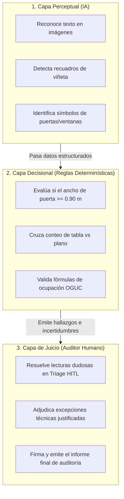

# Plan Review AI Hybrid — Modo con IA, Modo sin IA y Cómo Aprende el Sistema

> **Documento**: 06_modo_con_ia_modo_sin_ia_y_como_aprende.md  
> **Audiencia**: Ingenieros de ML, Auditores Técnicos, Jefes de Proyecto, Desarrolladores  
> **Propósito**: Explicar la dualidad de ejecución (con/sin modelos pesados) y desmitificar cómo el sistema mejora continuamente de forma controlada.

---

## 1. Dualidad de Ejecución: Modo con IA vs. Modo sin IA

El sistema está diseñado para ser completamente funcional tanto en servidores con alta capacidad gráfica (GPU) como en máquinas livianas o servidores de oficina con recursos limitados.

```
┌────────────────────────────────────────────────────────────────────────────┐
│                             MODO CON IA (COMPLETO)                         │
│                                                                            │
│   [PDF Rasterizado 300 DPI] ──> [PaddleOCR / Tesseract] ──> [Textos BBox]  │
│   [Área de Dibujo PNG]     ──> [YOLO / SAHI Visión]    ──> [Símbolos]      │
│   [Lámina Completa]        ──> [Segmentación Adaptativa]─> [Regiones]      │
└────────────────────────────────────────────────────────────────────────────┘

┌────────────────────────────────────────────────────────────────────────────┐
│                        MODO SIN IA (REGLAS + VECTORIAL)                    │
│                                                                            │
│   [PDF Vectorial CAD/BIM]  ──> [pdfplumber / PyMuPDF]  ──> [Textos TrueType│
│   [Capas de Líneas y Malla]──> [Heurística Geométrica] ──> [Tablas & Marco] │
│   [Área de Dibujo]         ──> [Bloques Vectoriales]   ──> [Símbolos CAD]  │
└────────────────────────────────────────────────────────────────────────────┘
```

---

## 2. Comparativa Técnica Detallada de Ambos Modos

| Característica | Modo con IA (Visión Profunda) | Modo sin IA (Determinístico Vectorial) |
| :--- | :--- | :--- |
| **Fuente de Datos** | Imágenes rasterizadas (PNG a 300 DPI) y escaneos. | Árbol de objetos vectoriales nativo del PDF. |
| **Lectura de Textos** | OCR neuronal tolerante a rotaciones y tipografías raras. | Extracción directa de cadenas de texto TrueType/Type1. |
| **Detección de Símbolos**| Redes neuronales convolucionales / YOLO sobre píxeles. | Detección de bloques vectoriales cerrados por heurística. |
| **Extracción de Tablas** | Detección visual de cuadrículas y líneas morfológicas. | Segmentación por intersección de líneas vectoriales. |
| **Consumo de Memoria** | Alto ($8\text{ GB} - 16\text{ GB}$ RAM / VRAM opcional). | Muy bajo ($< 2\text{ GB}$ RAM). |
| **Tiempo por Lámina A0**| $10 - 25\text{ segundos}$ por página. | $1 - 3\text{ segundos}$ por página. |
| **Dependencias Externas**| Pesos neuronales (PyTorch, Ultralytics, PaddleOCR). | Únicamente librerías estándar de parsing PDF. |

---

## 3. ¿Qué Hace la IA, qué Hacen las Reglas y qué Hace el Humano?



---

## 4. ¿Cómo "Aprende" Realmente el Sistema?

> [!IMPORTANT]
> **El sistema NO aprende mediante reentrenamiento autónomo descontrolado en caliente.**  
> En ingeniería y auditoría normativa, un modelo que cambia su comportamiento en producción de forma opaca destruye la reproducibilidad y genera riesgos legales.

El aprendizaje del sistema es **estructurado, auditable y bajo supervisión humana** mediante 5 mecanismos:

```
[1. Feedback Humano en Triage] ──> [2. Decision Precedents] ──> [3. Calibración de Confianza]
                                                                        │
[6. Nueva Versión de Pipeline] <── [5. Quality Gates & Eval] <── [4. Golden Datasets]
```

### Tabla: "De qué Aprende y para qué Sirve"

| Fuente de Aprendizaje | Qué Información Aporta | Cómo Mejora el Sistema |
| :--- | :--- | :--- |
| **Resoluciones HITL** | Acciones del auditor (*Confirm*, *Dismiss*, *Accept Risk*). | Crea *Decision Precedents* que sugieren la misma resolución ante casos similares. |
| **Golden Datasets** | Láminas con anotaciones Ground Truth aprobadas. | Permite medir objetivamente la mejora de nuevas versiones mediante CER, WER y F1. |
| **Memoria Normativa** | Nuevas ordenanzas, leyes o decretos promulgados. | Se codifican nuevas reglas en el `RuleEngine` sin tocar los modelos de visión. |
| **Librería de Símbolos** | Nuevos bloques de simbología específica de clientes. | Amplía el catálogo de plantillas vectoriales y clases de detección. |
| **Calibración de Políticas**| Umbrales de aceptación automática ($0.35 - 0.70$). | Reduce la cantidad de tareas manuales de triage sin aumentar falsos positivos. |

---

## 5. Qué NO Significa "Aprender" en este Sistema

- **NO significa** que el sistema inventará nuevas reglas normativas por sí solo.
- **NO significa** que el software modificará sus umbrales sin autorización de un administrador.
- **NO significa** que se usarán planos confidenciales de un cliente para entrenar modelos públicos de otros clientes (los datos privados de cada tenant quedan estrictamente aislados).

---

## 6. Ciclo de Mejora Continua Recomendado

1. **Operación Diaria**: Los auditores revisan planos y resuelven tareas de triage en la interfaz.
2. **Identificación de Casos Límite**: Se seleccionan láminas con geometrías complejas que generaron dudas.
3. **Incorporación al Golden Dataset**: Se añade la muestra a la suite de regresión (`regression dataset`) con anotaciones aprobadas.
4. **Evaluación de Nueva Versión**: Se prueba el nuevo extractor en el entorno de evaluación (`EvaluationService`).
5. **Pase a Producción**: Si el veredicto del Quality Gate es **`PASS`**, la nueva versión del pipeline se despliega oficialmente.
