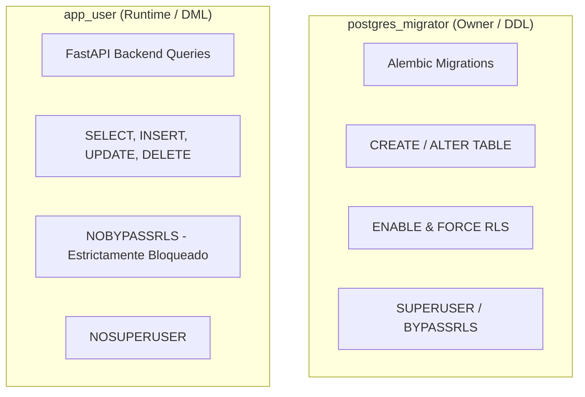

# Plan Review AI Hybrid — Seguridad, Multi-Tenant, RBAC y Requisitos para Funcionar

> **Documento**: 07_seguridad_multi_tenant_rbac_y_requisitos_para_funcionar.md  
> **Audiencia**: Oficiales de Seguridad, Administradores de Base de Datos (DBA), Arquitectos de Software, Desarrolladores  
> **Propósito**: Detallar el modelo de defensa en profundidad, autenticación, control de acceso basado en roles (RBAC) y aislamiento estricto por PostgreSQL Row-Level Security (RLS).

---

## 1. Modelo de Defensa en Profundidad Multi-Tenant

El sistema implementa **dos capas independientes y complementarias de aislamiento de datos**:

```
[Cliente HTTP] ──(1) JWT + Header X-Organization-Id──> [FastAPI Backend]
                                                              │
                                            (2) Validación RBAC en Código
                                                (403 si rol no permite acción)
                                                (404 si recurso es de otra Org)
                                                              │
                                            (3) Inyección de Contexto Transaccional
                                                SELECT set_config('app.current_organization_id', :org_id, true)
                                                              ▼
                                            [PostgreSQL 15+ Engine]
                                                (4) Row-Level Security (RLS)
                                                    Políticas USING y WITH CHECK
                                                    Rol: app_user (NOBYPASSRLS)
```

1. **Capa 1: Autorización en Backend (RBAC)**: Verifica la identidad del usuario y sus permisos para el rol activo en la organización.
2. **Capa 2: Aislamiento a Nivel de Motor (PostgreSQL RLS)**: Aunque un desarrollador cometa un error en una consulta SQL olvidando el filtro `WHERE organization_id = ...`, el motor PostgreSQL bloquea automáticamente cualquier fila ajena.

---

## 2. Matriz de Roles y Permisos (RBAC)

| Operación / Recurso | `admin` | `audit_lead` | `reviewer` | `contributor` | `viewer` |
| :--- | :---: | :---: | :---: | :---: | :---: |
| **Administrar Organización y Usuarios** | **SÍ** | NO | NO | NO | NO |
| **Crear y Editar Proyectos** | **SÍ** | **SÍ** | NO | NO | NO |
| **Subir Planos PDF (Intake)** | **SÍ** | **SÍ** | **SÍ** | **SÍ** | NO |
| **Lanzar Pipeline One-Click Review** | **SÍ** | **SÍ** | **SÍ** | **SÍ** (propios) | NO |
| **Resolver Triage HITL (ReviewTasks)** | **SÍ** | **SÍ** | **SÍ** | NO | NO |
| **Aprobar Anotaciones Golden Dataset** | **SÍ** | **SÍ** | **SÍ** | NO | NO |
| **Ver Informes PDF y Resúmenes** | **SÍ** | **SÍ** | **SÍ** | **SÍ** | **SÍ** |
| **Descargar Bundle ZIP con Manifiesto** | **SÍ** | **SÍ** | **SÍ** | **403 Forbidden** | **403 Forbidden** |
| **Consultar Trazas Crudas (`/traces`)** | **SÍ** | **SÍ** | **SÍ** | **403 Forbidden** | **403 Forbidden** |

---

## 3. Autenticación y Semántica de Tokens JWT

1. **Hashing Criptográfico**: Las contraseñas se almacenan mediante **Argon2id** (o PBKDF2-HMAC-SHA256 con 600,000 iteraciones como fallback de compatibilidad).
2. **Tokens de Identidad Pura**: El Access Token JWT contiene únicamente claims de identidad mínimas:
   ```json
   {
     "sub": "user-uuid-1234",
     "email": "auditor@constructora.cl",
     "jti": "jwt-token-id-5678",
     "exp": 1724250000,
     "iat": 1724221200,
     "iss": "plan-review-ai-hybrid"
   }
   ```
3. **Selección de Contexto Organizacional**:
   - El cliente envía el header `X-Organization-Id: <org-uuid>`.
   - **El header NO es fuente de verdad**: el backend verifica en base de datos que el usuario posea una membresía activa (`OrganizationMembership`) en dicha organización y resuelve dinámicamente su rol efectivo.

---

## 4. PostgreSQL Row-Level Security (RLS) en Detalle

### A. El Patrón Transaccional Fail-Closed
En cada petición HTTP, la sesión de base de datos ejecuta:

```sql
SELECT set_config('app.current_organization_id', :org_id, true);
```

- El parámetro `is_local = true` asegura que la variable de sesión quede **estrictamente acotada a la transacción activa**, impidiendo que se contamine la siguiente consulta cuando la conexión retorna al pool de SQLAlchemy.
- La función de seguridad `get_current_organization_id()` evalúa:
  ```sql
  NULLIF(current_setting('app.current_organization_id', true), '')
  ```
- **Comportamiento Fail-Closed**: Si una consulta se ejecuta sin setear la variable de organización, la función retorna `NULL`, haciendo que las políticas RLS evalúen a falso y retornen **0 filas** (nunca revelando registros).

### B. Políticas Directas y Heredadas
- **Tablas Directas** (`documents`, `projects`, `rule_findings`, `audit_reports`):
  ```sql
  CREATE POLICY rls_documents ON documents
  FOR ALL TO app_user
  USING (organization_id = get_current_organization_id())
  WITH CHECK (organization_id = get_current_organization_id());
  ```
- **Tablas Hijas por JOIN** (`document_sheets`, `extracted_texts`, `extracted_tables`, `detected_symbols`):
  ```sql
  CREATE POLICY rls_document_sheets ON document_sheets
  FOR ALL TO app_user
  USING (document_id IN (SELECT id FROM documents WHERE organization_id = get_current_organization_id()))
  WITH CHECK (document_id IN (SELECT id FROM documents WHERE organization_id = get_current_organization_id()));
  ```
- **Fuerza Bruta de RLS**: Se aplica `ALTER TABLE ... FORCE ROW LEVEL SECURITY` para asegurar que las políticas apliquen incluso si el usuario es dueño de la tabla.

---

## 5. Separación de Roles de Base de Datos



> [!WARNING]
> **ADVERTENCIA CRÍTICA DE SEGURIDAD**:  
> **Nunca conectes la aplicación FastAPI en producción usando el usuario `postgres` ni `postgres_migrator`.**  
> Si la aplicación corre con un rol que tiene `BYPASSRLS` o `SUPERUSER`, el motor PostgreSQL omitirá todas las políticas de seguridad por fila, anulando la protección multi-tenant.

---

## 6. Pendientes y Salvaguardas antes de Producción

1. **Revocación JWT en Redis**: En desarrollo, los tokens revocados se guardan en la memoria local del proceso (`_REVOKED_JTIS`). Para despliegues multi-nodo en producción debe conectarse Redis como almacén centralizado de revocación.
2. **Terminación TLS/HTTPS Obligatoria**: Toda comunicación entre el navegador y la API debe viajar encriptada mediante HTTPS para evitar la interceptación de tokens de acceso y planos confidenciales.
3. **Gestión de Secretos (KMS)**: La variable `SECRET_KEY` debe ser gestionada mediante un almacén seguro de secretos (e.g., HashiCorp Vault, AWS Secrets Manager, GCP Secret Manager) y nunca quedar expuesta en el repositorio Git.
