# Diagramas de Flujo del Asistente y Procesos del Sistema

> **Documento de Especificación Visual de Flujos de Trabajo**  
> **Versión de la Plataforma:** v0.3.0  
> **Propósito:** Representación gráfica completa de todos los flujos de decisión, percepción, interacción y aprendizaje del Asistente Operacional y los módulos de Plan Review AI Hybrid.

---

## 1. Flujo General del Proyecto con Intervención del Asistente

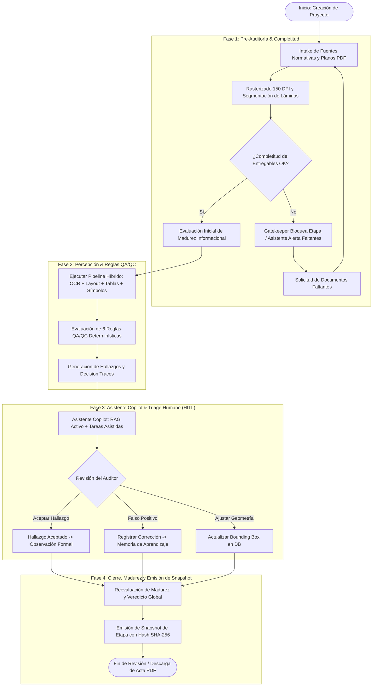

---

## 2. Flujo de Intake e Incorporación de Fuentes

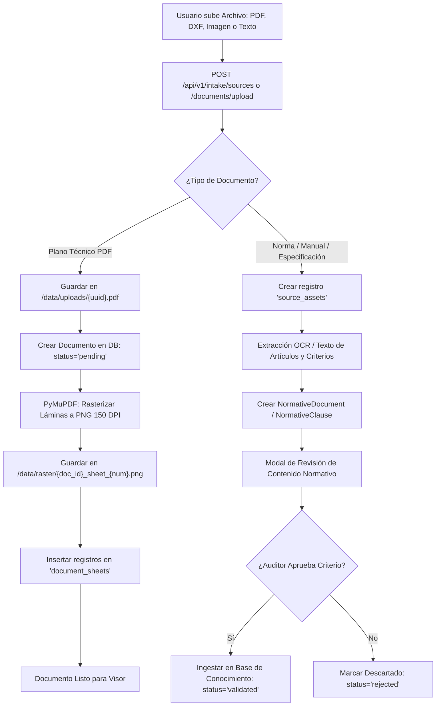

---

## 3. Flujo de Validación de Reglas y Paso hacia Baseline QA/QC

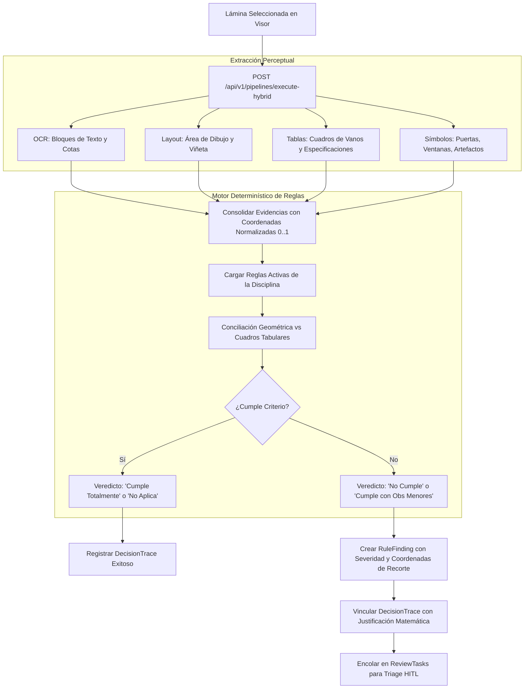

---

## 4. Flujo de Revisión Técnica por Etapas y Gatekeeper

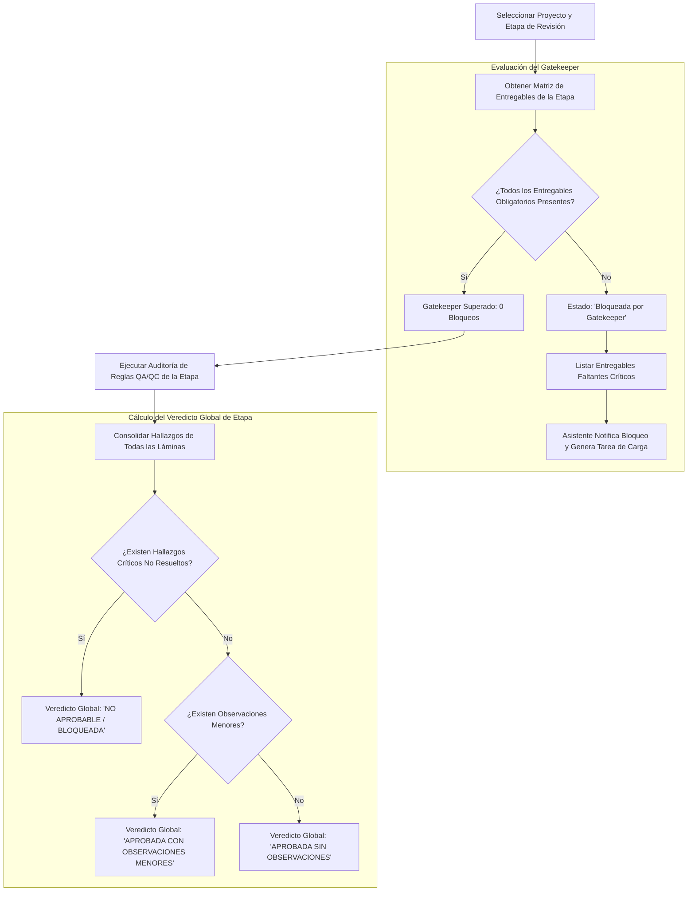

---

## 5. Flujo de Uso de la Base de Conocimiento Operacional

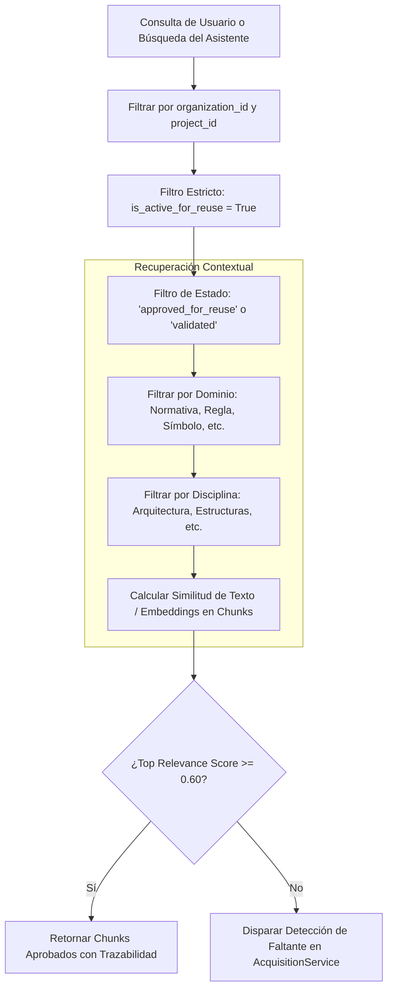

---

## 6. Flujo RAG del Asistente Copilot

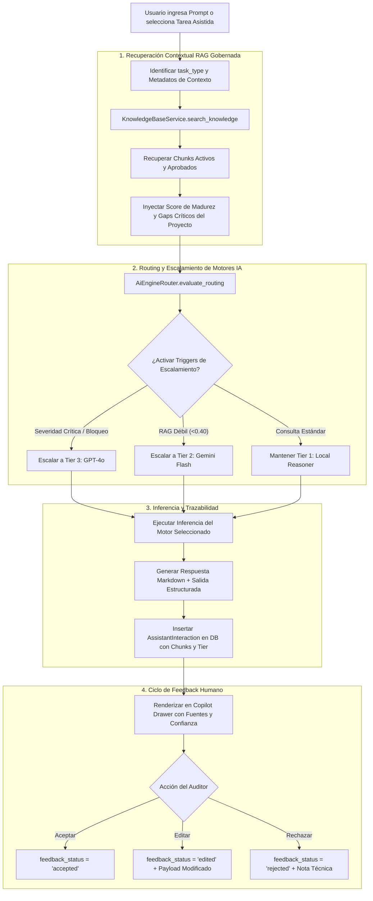

---

## 7. Flujo de Routing / Escalamiento entre Motores IA por Tiers

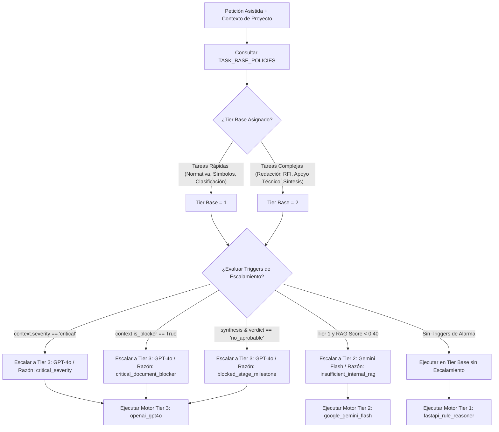

---

## 8. Flujo Web-First con Permiso Explícito

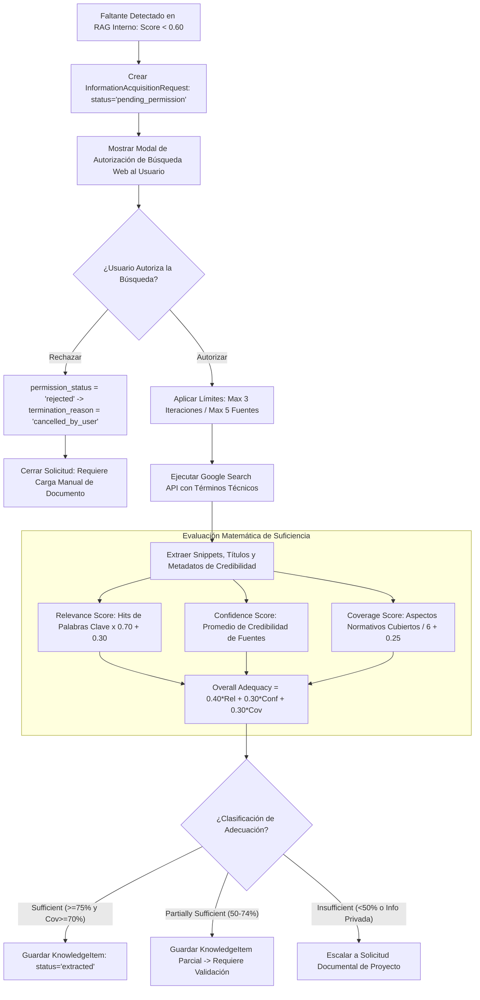

---

## 9. Flujo de Solicitud de Documentación Adicional al Usuario

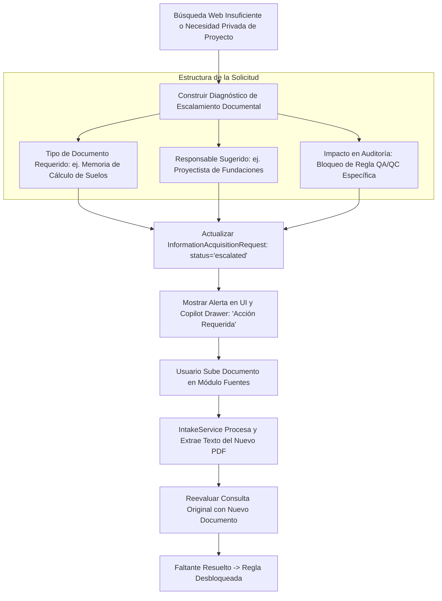

---

## 10. Flujo de Captura desde el Visor hacia Conocimiento Reutilizable

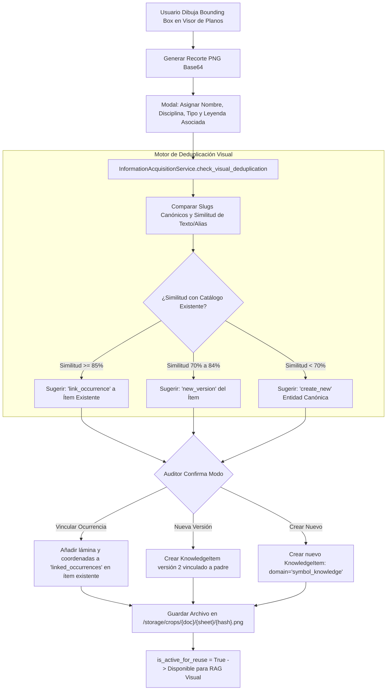

---

## 11. Flujo de Aprendizaje e Incorporación de Conocimiento Aprobado

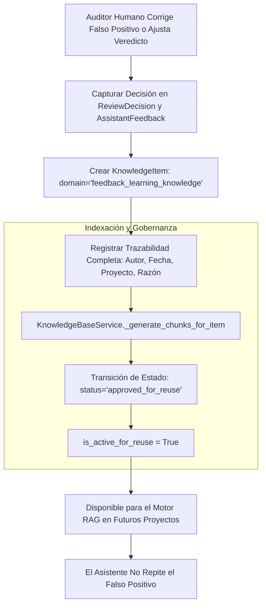

---

## 12. Flujo del Perfil de Madurez o Suficiencia Informacional por Proyecto

```mermaid
flowchart TD
    TriggerEval[Disparador: Cambio de Documentos, Aprobación de Reglas o Solicitud de Usuario] --> LoadProjectData[ProjectMaturityService.evaluate_project_maturity]
    
    subgraph CincoDimensiones["Evaluación de las 5 Dimensiones Ponderadas"]
        LoadProjectData --> D1[Dimensión 1: Documental & Planos (25%)\nLáminas, memorias, especificaciones]
        LoadProjectData --> D2[Dimensión 2: Completitud & Gatekeeper (25%)\nEntregables obligatorios y 0 bloqueos]
        LoadProjectData --> D3[Dimensión 3: Normativa & Criterios QA/QC (20%)\nCriterios aprobados y cobertura de reglas]
        LoadProjectData --> D4[Dimensión 4: Base de Conocimiento (15%)\nÍtems validados vs borradores]
        LoadProjectData --> D5[Dimensión 5: Observaciones & RFIs (15%)\nTasa de resolución y cierre]
    end
    
    D1 & D2 & D3 & D4 & D5 --> CalcOverallScore[Overall Score = Suma Ponderada (0 a 100%)]
    
    subgraph DiagnosticoYDelta["Diagnóstico, Gaps y Delta"]
        CalcOverallScore --> ClassifyLevel[Clasificar Nivel: initial, basic, intermediate, advanced, optimal]
        ClassifyLevel --> IdentifyGaps[Identificar Brechas Críticas y Rutas de Adquisición]
        IdentifyGaps --> ComparePrevious[Comparar con Perfil Anterior -> Calcular Delta Evolution]
    end
    
    ComparePrevious --> SaveMaturity[Guardar ProjectMaturityProfile en DB]
    SaveMaturity --> RenderMaturityBar[Renderizar Barra de Madurez y Tarjetas KPI en UI]
```

---

## 13. Flujo de Observaciones / RFIs / Cierre / Reapertura / Reutilización

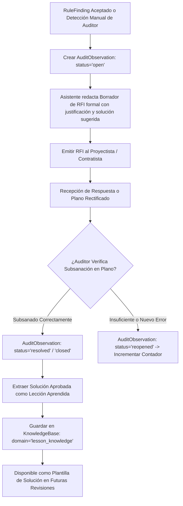

---

## 14. Flujo de Snapshots / Reportes / Exportaciones Relevantes

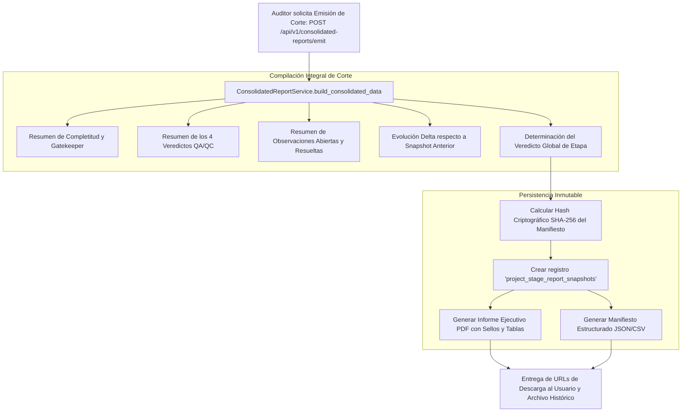
