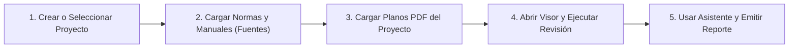

# Manual de Usuario — Plan Review AI Hybrid

> **Guía Práctica de Operación para Auditores, Revisores y Jefes de Proyecto**  
> **Versión de la Plataforma:** v0.3.0  
> **Enfoque:** Guía de uso directo en lenguaje simple, sin tecnicismos informáticos.

---

## 1. ¿Qué es Plan Review AI Hybrid y para qué sirve?

**Plan Review AI Hybrid** es un sistema digital diseñado para ayudar a ingenieros, arquitectos y equipos de revisión técnica a auditar planos de construcción y proyectos de ingeniería de manera rápida, ordenada y rigurosa.

El sistema combina tres cosas fundamentales:
1. **Lectura visual y digital de planos:** Detecta automáticamente textos, cotas, viñetas, cuadros de vanos y símbolos gráficos en láminas PDF.
2. **Revisión contra reglas y normas técnicas:** Evalúa si el plano cumple con la normativa obligatoria (por ejemplo, dimensiones mínimas de puertas, correspondencia con cuadros de especificaciones, escalas y viñetas).
3. **Un Asistente de Inteligencia Artificial que aprende de forma controlada:** Te asiste respondiendo dudas normativas, redactando observaciones técnicas formales, sugiriendo veredictos y detectando qué antecedentes faltan en el proyecto.

> **Principio de Seguridad:** El sistema **nunca inventa información ni aprueba nada por su cuenta**. Cada sugerencia del asistente debe ser confirmada o aprobada por ti como profesional responsable (*Human-in-the-Loop*).

---

## 2. ¿Qué hace el Asistente Operacional?

El Asistente Operacional es tu copiloto durante la revisión del proyecto. Se encuentra disponible en un panel lateral deslizante (**Copilot**) y cuenta con un catálogo de tareas especializadas:

- **Consultas Normativas:** Le preguntas sobre un artículo de la ordenanza o norma técnica y te responde citando el texto oficial almacenado en el sistema.
- **Clarificación de Símbolos y Leyendas:** Si ves un símbolo extraño en el plano, el asistente lo busca en el catálogo de símbolos de la empresa y te indica qué significa y en qué leyenda está respaldado.
- **Chequeo de Completitud (Gatekeeper):** Te indica si ya se cargaron todos los documentos y planos obligatorios para la etapa actual del proyecto (por ejemplo, Ingeniería Básica o Ingeniería de Detalle).
- **Redacción de Observaciones y RFIs:** Te ayuda a redactar hallazgos técnicos formales con justificación normativa y recomendación de solución para el proyectista.
- **Explicación de Hallazgos:** Te explica paso a paso por qué una regla técnica marcó un error o discrepancia en el plano.
- **Síntesis Ejecutiva de Etapa:** Resume el estado general del proyecto antes de emitir un informe formal.

---

## 3. ¿Qué debes cargar primero? (Paso a Paso Inicial)

Para que el sistema funcione con precisión en un proyecto nuevo, se recomienda seguir este orden de carga:

1. **Crear o Seleccionar el Proyecto:** Ve a la pestaña **Proyectos** y crea tu proyecto indicando su código (ej. `PRJ-TORRE-A`), disciplina y etapa de revisión.
2. **Cargar la Base Normativa y Criterios (Fuentes):** En la sección **Fuentes**, sube los manuales técnicos, ordenanzas (ej. OGUC) o especificaciones de la empresa.
3. **Cargar los Planos PDF:** En **Fuentes / Planos**, sube los archivos PDF de tus láminas técnicas.
4. **Abrir el Visor de Planos:** Ingresa a **Visor** para visualizar las láminas con sus capas automáticas.

---

## 4. Carga de Documentos e Intake de Fuentes

En el módulo **Fuentes & Base Normativa**, puedes incorporar documentos mediante tres vías:

### A. Subida Local de Archivos
1. Haz clic en el botón **"Registrar Fuente"** o **"Subir Plano PDF"**.
2. Selecciona tu archivo desde tu computador (PDF, imágenes o documentos de texto).
3. Selecciona la **Disciplina** correspondiente (Arquitectura, Estructuras, Mecánica, Eléctrica, Instrumentación, Piping o crea una personalizada eligiendo *"Otros"*).
4. El sistema procesará el documento automáticamente.

### B. Revisión de Contenido y Aprobación de Reglas
- Cuando subes una norma o estándar, el sistema extrae los artículos y criterios técnicos.
- Abre la ventana de **Revisión de Contenido Normativo** para confirmar qué artículos son válidos. Al presionar **"Aprobar Criterio"**, este pasa a formar parte de las reglas oficiales que el asistente usará para auditar.

---

## 5. Cómo Usar el Visor de Planos

El **Visor de Planos** es el espacio donde interactúas directamente con la lámina técnica:

### Navegación y Herramientas
- **Zoom y Paneo:** Usa la rueda del mouse o los botones `+` / `-` para ampliar áreas con detalle. Mantén presionado el clic para arrastrar la lámina.
- **Capas de Información (Overlays):** En la barra superior del visor puedes encender o apagar capas:
  - 🔵 **Textos y Cotas (OCR):** Muestra las cajas donde se reconoció texto.
  - 🟣 **Macro-Regiones (Layout):** Muestra el área de dibujo y la viñeta/cuadro de rotulación.
  - 🟢 **Tablas:** Resalta los cuadros de vanos o matrices técnicas.
  - 🟡 **Símbolos Detectados:** Resalta puertas, ventanas, artefactos o equipos.
  - 🔴 **Hallazgos QA/QC:** Muestra con recuadros rojos las discrepancias detectadas por las reglas.

### Captura Visual de Conocimiento desde el Plano
Si encuentras un símbolo, una tabla de especificaciones o un detalle típico que quieres que el sistema recuerde para siempre:
1. Activa la herramienta **Seleccionar Área / Recorte**.
2. Dibuja un rectángulo sobre el símbolo o tabla en el plano.
3. Se abrirá una ventana donde puedes:
   - Asignar un **Nombre Canónico** (ej. `Válvula de Control 2 Pulgadas`).
   - Indicar su **Disciplina** y a qué leyenda o norma pertenece.
   - **Vincular Ocurrencia:** Si el símbolo ya existía en la empresa, el sistema te avisará y te permitirá asociar este nuevo plano sin duplicar información.
4. Al guardar, el recorte se almacena en la **Base de Conocimiento** como evidencia gráfica aprobada.

---

## 6. Cómo Confirmar o Aprobar Información (Triage Humano)

El sistema opera bajo el principio de **Revisión Humana en el Bucle (HITL)**. Cuando una regla detecta una posible no conformidad:

1. Ve a la pantalla de **Triage / Revisión**.
2. Cada hallazgo muestra:
   - La regla que lo originó (ej. *Falta de coincidencia entre puertas del plano y cuadro de vanos*).
   - El recorte exacto de la lámina donde ocurrió la discrepancia.
   - La justificación técnica y el nivel de severidad (Crítica, Alta, Media, Informativa).
3. Dispones de tres acciones claras:
   - **Aceptar Hallazgo:** Confirmas que el error es real y debe ir al informe para el proyectista.
   - **Marcar Falso Positivo:** Indicas que el plano está correcto por una condición particular. Al hacer esto, el sistema registra tu nota técnica para no volver a cometer el mismo error en planos similares.
   - **Corregir Geometría:** Ajustas la caja de ubicación en el plano si fue detectada de forma imprecisa.

---

## 7. Cómo Usar el Asistente Copilot para Apoyo en la Revisión

Para consultar al Asistente en cualquier momento:

1. Haz clic en el botón flotante del **Asistente (Copilot)** en el lateral derecho de la pantalla.
2. Puedes elegir una **Tarea Asistida** recomendada del menú desplegable:
   - *¿Cumple esta lámina con el ancho de evacuación de la OGUC?*
   - *Redactar borrador de RFI para discrepancia en cuadro de puertas.*
   - *¿Qué documentos me faltan para cerrar la etapa de Ingeniería Básica?*
3. O puedes escribir libremente tu consulta en el campo de texto.
4. **Respuesta Transparente:** El asistente te responderá mostrando:
   - El texto de la respuesta o borrador.
   - **Fuentes Utilizadas:** Los artículos y documentos específicos de donde extrajo la información.
   - **Nivel de Confianza:** Si la información es certera o si requiere verificación adicional.
5. **Aceptar / Editar / Rechazar Sugerencia:** Debajo de cada respuesta verás botones para incorporar la sugerencia directamente a tus observaciones o rechazarla con un comentario.

---

## 8. ¿Cómo Entender qué Información Falta? (Gatekeeper y Madurez)

El sistema evalúa constantemente si tu proyecto cuenta con toda la información necesaria para considerarse completo:

1. **Tarjeta de Completitud & Gatekeeper:** En el panel del proyecto o en el reporte consolidado verás si faltan entregables obligatorios (ej. *Memoria de Cálculo Estructural*, *Plano de Evacuación*).
   - Si un entregable obligatorio falta, el **Gatekeeper** marcará la etapa como **Bloqueada** o **Parcial**, evitando que se emita una aprobación errónea.
2. **Perfil de Madurez Informacional:** Te muestra un porcentaje global (0 a 100%) y el desglose en 5 áreas:
   - 📄 Cobertura de Planos y Láminas.
   - 📋 Entregables y Gatekeeper.
   - ⚖️ Normas y Criterios incorporados.
   - 🧠 Conocimiento y Evidencias aprobadas.
   - 🔍 Cierre de Observaciones y RFIs.

---

## 9. Permiso de Búsqueda Web: ¿Cómo Responder?

Cuando le pides al asistente información que no está en los documentos del proyecto ni en la base normativa interna:

1. El sistema detecta una **laguna de información** (*Gap*).
2. **Solicitud de Permiso:** Aparecerá una alerta en pantalla:  
   > *«La información para "Válvula de retención norma API 6D" no se encuentra en los documentos internos. ¿Autoriza al Asistente a buscar en fuentes web oficiales?»*
3. **Tus opciones:**
   - **Autorizar Búsqueda:** El asistente consultará fuentes oficiales en internet (con un límite estricto de seguridad de 3 intentos y hasta 5 fuentes calificadas).
   - **Rechazar Búsqueda:** Cancela la consulta web si el proyecto es estrictamente confidencial o si prefieres aportar tú mismo el documento.

---

## 10. Cómo Aportar Documentación Adicional si la IA no Encuentra Suficiente

Si la búsqueda web no arroja resultados suficientes o si el dato requerido es exclusivo de tu proyecto (por ejemplo, una *Especificación Técnica Particular* o un *Estudio de Mecánica de Suelos*):

1. El Asistente cambiará la solicitud a **"Solicitud Documental de Proyecto"**.
2. Te indicará exactamente qué documento se necesita (ej. *Certificado del Fabricante* o *Memoria de Cálculo de Fundaciones*) y quién debería proporcionarlo.
3. Para resolverlo:
   - Ve a **Fuentes**.
   - Sube el documento PDF solicitado.
   - Vuelve al Asistente y presiona **"Reevaluar con nueva fuente"**.

---

## 11. Cómo Consultar lo que el Sistema Aprendió

En la pestaña **Base de Conocimiento**:

- Podrás explorar todo el saber acumulado de tu empresa:
  - 📖 Criterios normativos aprobados.
  - 📐 Símbolos y leyendas homologadas.
  - 💡 Lecciones aprendidas de auditorías anteriores (falsos positivos corregidos, respuestas a RFIs).
- **Filtros:** Puedes filtrar por disciplina, por proyecto o consultar el catálogo global.
- **Estados del Conocimiento:**
  - 🟢 **Aprobado para Reutilización / Validado:** Información oficial que el asistente usará activamente.
  - 🟡 **En Revisión / Extraído:** Información pendiente de validación por un auditor.
  - 🔴 **Archivado / Rechazado:** Información descartada o que quedó obsoleta.

---

## 12. Cómo Exportar y Revisar los Resultados

Al finalizar la revisión de una lámina o de una etapa completa:

1. Ve a **Reportes Consolidados de Etapa**.
2. Podrás visualizar:
   - **Veredicto Global de la Etapa:**  
     - ✅ *Aprobada sin Observaciones*  
     - 🟡 *Aprobada con Observaciones Menores*  
     - 🔴 *No Aprobable / Bloqueada por Gatekeeper o Hallazgos Críticos*  
     - ⚪ *Parcial / En Revisión*
   - **Resumen de los 4 Veredictos QA/QC.**
   - **Lista consolidada de Observaciones y RFIs abiertos.**
   - **Evolución Delta:** Qué observaciones fueron resueltas respecto a la revisión anterior.
3. Presiona **"Emitir Snapshot de Etapa"** para congelar la revisión con fecha, hora, responsable y código de verificación (*Manifest Hash*).
4. Descarga el informe en **PDF** o en formato estructurado **JSON/CSV** para enviarlo al cliente o al contratista.

---

## 13. Preguntas Frecuentes y Solución de Dudas Rápidas

| Pregunta Frecuente | Respuesta Práctica |
| :--- | :--- |
| **¿La IA puede modificar mis planos originales?** | No. El sistema nunca modifica los archivos PDF subidos. Trabaja sobre copias rasterizadas y genera capas visuales superpuestas. |
| **¿Qué pasa si no apruebo una respuesta del Asistente?** | La respuesta queda en estado pendiente y no se utiliza como base para auditorías automáticas futuras. |
| **¿Por qué el asistente me dice "Información Insuficiente"?** | Ocurre cuando el tema consultado no está en los documentos cargados ni en la normativa aprobada. Puedes subir el archivo faltante en *Fuentes*. |
| **¿Cómo sé si mi proyecto está listo para entrega?** | Revisa la pestaña *Perfil de Madurez*. Si el semáforo está en verde (>80%), no hay bloqueos de Gatekeeper y los hallazgos críticos están cerrados, está listo para emisión. |
| **¿Puedo usar el sistema sin conexión a internet?** | Sí. El sistema cuenta con un motor local determinístico (Tier 1) y base de datos interna que opera 100% desconectada. Solo las funciones de búsqueda web o modelos en la nube requieren conexión. |
