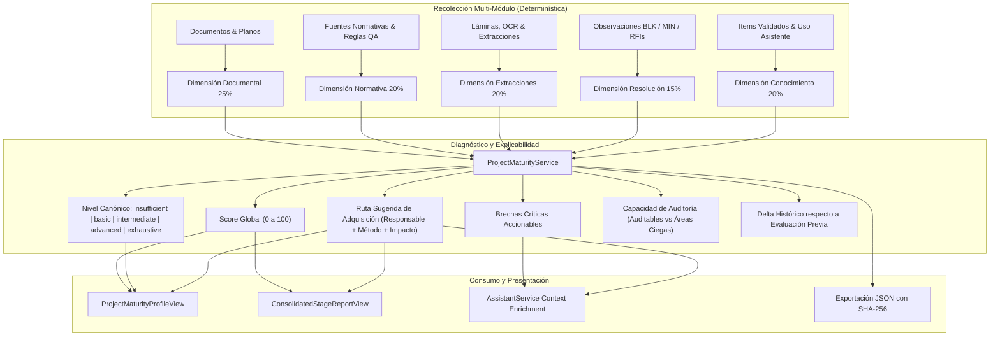

# Walkthrough: Perfil de Madurez / Suficiencia Informacional por Proyecto

Se ha completado e integrado con éxito el **Perfil de Madurez o Suficiencia Informacional por Proyecto**, conectando en un único diagnóstico explicable y determinístico la **Completitud Documental (Gatekeeper)**, la **Evidencia Técnica**, el **Cumplimiento de Reglas QA/QC**, las **Observaciones/RFIs**, la **Base de Conocimiento Operacional** y el **Uso del Asistente RAG**.

---

## 1. Arquitectura de Evaluación Multidimensional

---

## 2. Taxonomía Canónica de 5 Niveles y Ponderación

### Dimensiones Evaluadas:
1. **Completitud Documental & Planos (25%)**: Requisitos obligatorios cubiertos, estado en matriz Gatekeeper (`eligible_as_evidence`).
2. **Marco Normativo & Reglas QA/QC (20%)**: Fuentes normativas aprobadas en Intake y reglas QA/QC activas asociadas.
3. **Extracciones & Metadatos Técnicos (20%)**: Láminas rasterizadas, OCR general, viñetas y tablas extraídas.
4. **Resolución de Observaciones & RFIs (15%)**: Ratio de observaciones y bloqueos BLK resueltos vs pendientes.
5. **Base de Conocimiento & Asistente RAG (20%)**: Items aprobados para reutilización (`approved_for_reuse`) y uso efectivo en interacciones asistidas.

### Escala Canónica de Niveles:
| Nivel | Rango Score | Significado Técnico | Veredicto de Etapa Permitido |
| :--- | :---: | :--- | :---: |
| `insufficient` | 0 – 34.9 | Bloqueado / sin documentos base suficientes para auditar. | ❌ No |
| `basic` | 35.0 – 59.9 | Planos preliminares presentes; faltan memorias, especificaciones o normativas clave. | ❌ No |
| `intermediate` | 60.0 – 79.9 | Evidencia técnica apta, normativas asociadas, asistente activo con consultas de proyecto. | ⚠️ Condicional |
| `advanced` | 80.0 – 94.9 | Alta completitud, reglas QA/QC verificadas, RFIs cerrados, KB validada y reutilizable. | ✅ Sí |
| `exhaustive` | 95.0 – 100 | Trazabilidad documental y normativa total, cero áreas ciegas. | ✅ Sí |

---

## 3. Rutas Sugeridas de Adquisición de Información

Cada brecha detectada genera de forma determinística una **Ruta de Adquisición Accionable**:
- **Qué falta**: Documento, memoria, fuente normativa, artículo de norma o resolución de bloqueo.
- **Por qué importa**: Impacto normativo o técnico en la disciplina.
- **Qué bloquea**: Reglas QA/QC o hitos de etapa impedidos.
- **Prioridad**: `critical`, `high`, `medium`.
- **Fuente probable**: Ej. *Archivo de Ingeniería Estructural*, *Portal Normativo MINVU/OGUC*, *Especialista Eléctrico*.
- **Responsable sugerido**: Ej. *Ingeniero Calculista*, *Auditor Líder QA/QC*, *Arquitecto Patrocinante*.
- **Método de ingreso**: Ej. *Carga en Intake Documental*, *Registro en Fuentes Normativas*, *Sincronización en Base de Conocimiento*.
- **Ganancia estimada de Score**: Aumento porcentual esperado (+5 pts, +10 pts, +15 pts).

---

## 4. Componentes y Módulos Desarrollados

### Backend
- **Modelo DB**: [`ProjectMaturityProfile`](file:///c:/Users/Windows/OneDrive/Estructura%20Proyectos/plan-review-ai-hybrid/backend/app/db/models/maturity.py) con almacenamiento persistente de scores, dimensiones, disciplinas, brechas, rutas, diagnósticos y deltas.
- **Servicio**: [`ProjectMaturityService`](file:///c:/Users/Windows/OneDrive/Estructura%20Proyectos/plan-review-ai-hybrid/backend/app/services/maturity/service.py) con auditoría integral, cálculo determinístico, generación de rutas de adquisición y exportación con hash SHA-256.
- **Endpoints REST**: [`backend/app/api/v1/endpoints/maturity.py`](file:///c:/Users/Windows/OneDrive/Estructura%20Proyectos/plan-review-ai-hybrid/backend/app/api/v1/endpoints/maturity.py) (`latest`, `evaluate`, `history`, `acquisition-routes`, `export`).
- **Enriquecimiento del Asistente**: [`AssistantService`](file:///c:/Users/Windows/OneDrive/Estructura%20Proyectos/plan-review-ai-hybrid/backend/app/services/assistant/service.py) inyecta el perfil de madurez y las brechas principales en el `context_data` de inferencia.

### Frontend
- **Tipos TypeScript**: [`frontend/src/types/index.ts`](file:///c:/Users/Windows/OneDrive/Estructura%20Proyectos/plan-review-ai-hybrid/frontend/src/types/index.ts) con todas las interfaces DTO de madurez.
- **Cliente API**: [`frontend/src/services/api.ts`](file:///c:/Users/Windows/OneDrive/Estructura%20Proyectos/plan-review-ai-hybrid/frontend/src/services/api.ts).
- **Componente Principal**: [`ProjectMaturityProfileView.tsx`](file:///c:/Users/Windows/OneDrive/Estructura%20Proyectos/plan-review-ai-hybrid/frontend/src/components/ProjectMaturityProfileView.tsx) con score interactivo, tarjetas de dimensiones, rutas de adquisición con responsables sugeridos, diagnóstico de áreas ciegas y exportación JSON SHA-256.
- **Integraciones**:
  - En [`ProjectsPage.tsx`](file:///c:/Users/Windows/OneDrive/Estructura%20Proyectos/plan-review-ai-hybrid/frontend/src/pages/ProjectsPage.tsx) como pestaña de inspección de proyecto.
  - En [`ConsolidatedStageReportView.tsx`](file:///c:/Users/Windows/OneDrive/Estructura%20Proyectos/plan-review-ai-hybrid/frontend/src/components/ConsolidatedStageReportView.tsx) como sección de auditoría del informe final.

---

## 5. Resultados de Pruebas y Validación

### Tests de Integración Backend:
- Suite específica: `backend/tests/integration/test_project_maturity_and_acquisition_route.py`
  - `test_initial_insufficient_project_maturity`: **PASSED** (score inicial < 35 pts, diagnóstico de bloqueo).
  - `test_acquisition_routes_generation`: **PASSED** (rutas estructuradas con responsable, método y ganancia estimada).
  - `test_maturity_evolution_after_knowledge_incorporation`: **PASSED** (incorporación de datos, salto de madurez a nivel superior, delta histórico positivo, trazabilidad de uso en asistente y exportación SHA-256).
- Suite transversal: **25 PASSED, 10 SKIPPED (PostgreSQL RLS)** sin regresiones en ningún módulo.

### Compilación Frontend:
- `npm run build`: **0 errores**, bundle generado limpiamente.
