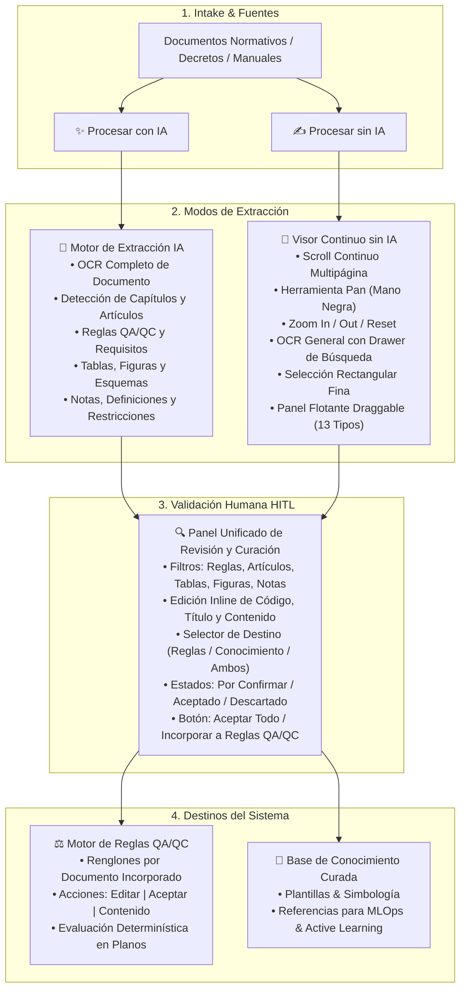

# Implementación y Validación: Intake & Incorporación de Fuentes hacia el Motor de Reglas QA/QC (Con IA y Sin IA)

Se ha implementado de forma completa e integrada en **Plan Review AI Hybrid** la arquitectura de incorporación estructurada de conocimiento desde **Intake & Fuentes** hacia el **Motor de Reglas QA/QC** y la **Base de Conocimiento**, ofreciendo los dos flujos solicitados: **CON IA** y **SIN IA**.

---

## 1. Arquitectura General y Flujo de Gobernanza



---

## 2. Componentes y Funcionalidades Desarrolladas

### A) Sección "Intake & Fuentes" (`SourcesPage.tsx`)
- **3 Acciones Principales en Cabecera**:
  1. **Registrar Fuente**: Registro tradicional de fuentes en gobierno con selección de disciplinas.
  2. **✨ Procesar con IA**: Dispara modal de extracción automática inteligente.
  3. **✍️ Procesar sin IA**: Abre el visor continuo interactivo.
- **Acciones Rápidas por Renglón**: Cada fuente registrada cuenta ahora con botones directos `Con IA` y `Sin IA`.

---

### B) Flujo CON IA (`ai_extractor.py` + `ProcessWithAiModal`)
- Lectura estructurada de documentos completos o extractos normativos con OCR integrado.
- Desglose automático en:
  - **Capítulos y Secciones**
  - **Artículos y Reglas QA/QC**
  - **Tablas y Cuadros Técnicos**
  - **Figuras, Esquemas y Símbolos**
  - **Notas, Definiciones y Restricciones**
- Salida inmediata hacia el panel de curación y validación humana obligatoria.

---

### C) Flujo SIN IA (`DocumentManualViewerModal.tsx`)
- **Visor Continuo de Documentos**: Visualización fluida tipo PDF continuo con múltiples páginas y scroll corrido.
- **Herramienta Pan**: Arrastre libre con cursor de **mano negra** (`grab` / `grabbing`).
- **Herramientas de Zoom**: `Zoom In`, `Zoom Out`, `Reset (100%)` y zoom con rueda del mouse.
- **OCR General del Documento**: Drawer lateral deslizable con extracción OCR continua de todo el documento, buscador de texto y copiado en un clic.
- **Selección de Regiones**: Trazado rectangular fino con cursor de **cruz roja**.
- **Panel Flotante Draggable**:
  - Arrastre libre desde el header.
  - Taxonomía completa de **13 tipos**: `rule`, `article`, `chapter`, `table`, `image`, `figure`, `symbol`, `text_note`, `definition`, `procedure`, `restriction`, `requirement`, `other`.
  - Captura y edición de texto OCR del fragmento.
  - Selector de destino (`Motor de Reglas`, `Base de Conocimiento` o `Ambos`).

---

### D) Panel Unificado de Revisión y Validación (`SourceExtractionReviewModal.tsx`)
- Filtros por categoría: *Todas*, *Reglas QA/QC*, *Artículos & Capítulos*, *Tablas*, *Figuras & Esquemas*, *Notas & Definiciones*.
- Acciones por elemento:
  - ✏️ **Editar**: Modificar título, código de artículo, descripción, texto OCR y destino.
  - ✓ **Aceptar / Desmarcar**: Cambiar estado a `accepted` o `to_confirm`.
  - 🗑️ **Eliminar**: Descartar el elemento.
- Footer con botones **Cancelar** y **Aceptar Todo / Incorporar a Reglas QA/QC**.

---

### E) Destino: Motor de Reglas QA/QC (`RulesPage.tsx` + `RuleDocument`)
- **Sección Superior**: *Documentos Normativos & Fuentes Incorporadas* con tabla de renglones detallando:
  - Título y Descripción.
  - Tipo de Documento (`norma`, `manual`, `decreto`, etc.).
  - Origen (`Con IA`, `Sin IA`).
  - Disciplina y Versión.
  - Conteo desglosado: `X reglas`, `Y tablas`, `Z figuras`.
  - Estado: `Activo` / `Borrador`.
- **3 Botones de Acción por Renglón**:
  1. **✏️ Editar**: Modal para modificar metadatos (título, descripción, disciplina, versión, organismo emisor).
  2. **✓ Aceptar**: Guardar y aprobar el documento en estado activo.
  3. **📂 Contenido**: Abre el modal de inspección detallada donde se visualizan todas las reglas, tablas e imágenes asociadas con trazabilidad.
- **Sección Inferior**: *Reglas Baseline QA/QC del Sistema*.

---

### Walkthrough: Corrección Definitiva y Validación de Visor, OCR Secundario y Menú de Selecciones

Se completó el diagnóstico exhaustivo y la corrección integral en el frontend para el flujo de selección, guardado, re-edición y OCR secundario sobre el plano general en la sección **“Visor de Planos & Overlays”**.

## Walkthrough: Base de Conocimiento Operacional para el Asistente

## Resumen de la Entrega

Se completó la implementación integral, persistente, gobernada y trazable de la **Base de Conocimiento Operacional** para el Asistente Técnico de Revisión de Proyectos, permitiendo consolidar, estructurar, versionar y recuperar conocimiento transversal de todas las etapas del ciclo de vida del proyecto y su auditoría.

---

## 1. Arquitectura de Conocimiento y Modelos

- **`KnowledgeItem`** ([`backend/app/db/models/knowledge_base.py`](file:///c:/Users/Windows/OneDrive/Estructura%20Proyectos/plan-review-ai-hybrid/backend/app/db/models/knowledge_base.py)):
  - Multi-tenant estricto con `organization_id` y scoping opcional por `project_id`.
  - Dominios canónicos: `normative_knowledge`, `rule_knowledge`, `deliverable_knowledge`, `guide_document_knowledge`, `review_knowledge`, `observation_rfi_knowledge`, `project_knowledge`, `feedback_learning_knowledge`.
  - Ciclo de vida explícito: `draft`, `extracted`, `reviewed`, `validated`, `approved_for_reuse`, `superseded`, `archived`, `rejected`.
  - Bandera determinística `is_active_for_reuse`: solo `approved_for_reuse` y `validated` son elegibles para RAG/reutilización.
  - Trazabilidad nativa: `source_asset_id`, `rule_id`, `observation_id`, `stage_snapshot_id`, `parent_item_id`, `superseded_by_id`, `version_number` y `provenance_trace`.

- **`KnowledgeChunk`** ([`backend/app/db/models/knowledge_base.py`](file:///c:/Users/Windows/OneDrive/Estructura%20Proyectos/plan-review-ai-hybrid/backend/app/db/models/knowledge_base.py)):
  - Fragmentación atómica de párrafos/artículos con `token_count` estimado.
  - Almacenamiento JSON para embeddings vectoriales `embedding_vector`.
  - Metadatos indexables de dominio, etapa, disciplina y contexto.

---

## 2. Sincronizadores Transversales Implementados

- **Intake & Fuentes**: Criterios normativos y artículos de leyes/ordenanzas (`OGUC`, `NCh`).
- **Motor de Reglas QA/QC**: Definiciones de reglas baseline activas con requisitos de entrada y severidad.
- **Matriz de Completitud**: Especificaciones de entregables y reglas bloqueadas por el gatekeeper.
- **Observaciones & RFIs**: Lecciones aprendidas y resoluciones técnicas validadas de hallazgos cerrados.
- **Snapshots Consolidados**: Síntesis de corte de etapa, veredicto global, estado de gatekeeper y hash SHA-256 inmutable.

---

## 3. Gobernanza, Versionamiento y Motor RAG

- **Control de Estados**: Transición formal con registro del revisor y notas de auditoría.
- **Versionamiento con Linaje**: Creación de nueva versión ($v_{n+1}$), marcando la versión anterior como `superseded` e inactiva para reutilización.
- **Recuperador Contextual (RAG Readiness)**: Búsqueda léxica ponderada, con filtros multidimensionales (dominio, disciplina, etapa, proyecto) y exclusión estricta de ítems no aprobados.

---

## 4. UI Interactiva (`KnowledgeBaseManager.tsx`)

- Métricas y KPIs en tiempo real (total unidades, reutilizables, por validar, distribuciones por dominio y disciplina).
- Filtros avanzados y catálogo reactivo de unidades de conocimiento.
- Inspector de Procedencia y Linaje con visualización de chunks, metadatos y trazabilidad de eventos.
- Barra de gobernanza para aprobar, validar, rechazar o archivar con un solo clic.
- Modal de nueva versión con historial de versiones.
- **Simulador de Recuperación RAG en Vivo**: Permite probar consultas contra la base operativa antes de su consumo por motores LLM.

---

## 5. Resultados de Validación y Tests

- **Tests de Integración de Base de Conocimiento**: `test_knowledge_base_operational.py` **PASÓ (100%)**.
- **Suite Completa de Integración Backend**: 17 passed, 10 skipped en 11.42s (**100% de éxito, 0 fallos**).
- **Compilación de Frontend**: `npm run build` completado limpiamente con 0 errores TypeScript.

---

## 6. Diagnóstico y Causa Exacta del Error (Visor de Planos)

1. **Causa Raíz Identificada:**
   - En el renderizado de los overlays de selecciones manuales (`manualAnnotations.map`) y en el recuadro de selección activa (`cropBboxNormalized`), la desestructuración de coordenadas `[x0, y0, x1, y1]` y la invocación de `setSelectionMenu` se ejecutaban sin validación defensiva contra estructuras de datos no normalizadas devueltas tras el ciclo de guardado/rehidratación de la API.
   - En el menú contextual de clic sobre selecciones (`selectionMenu`), las opciones carecían de apertura directa hacia la edición de datos con coordenadas normalizadas seguras, lo que provocaba inconsistencias al reabrir el modal sobre entidades guardadas.

2. **Archivos Modificados:**
   - [`frontend/src/pages/PlanViewerPage.tsx`](file:///c:/Users/Windows/OneDrive/Estructura%20Proyectos/plan-review-ai-hybrid/frontend/src/pages/PlanViewerPage.tsx):
     - Manejo de click izquierdo sobre anotaciones del visor con `setSelectionMenu({ x: e.clientX, y: e.clientY, annotation: ann })`.
     - Cierre global coordinado de menús contextuales en `handleGlobalClick`.
     - Desestructuración segura de `bbox_normalized`: `const bbox = Array.isArray(ann.bbox_normalized) && ann.bbox_normalized.length === 4 ? ann.bbox_normalized : [0, 0, 0, 0]`.
     - Guarda segura para el marco de selección activa `cropBboxNormalized`.
     - Inclusión del botón **"Editar datos"** dentro de `selectionMenu` con recarga limpia del recorte y coordenadas.
   - [`frontend/src/components/AnnotationClassifyModal.tsx`](file:///c:/Users/Windows/OneDrive/Estructura%20Proyectos/plan-review-ai-hybrid/frontend/src/components/AnnotationClassifyModal.tsx):
     - Fallback de previsualización con `initialData.crop_image_path` cuando `cropImageBase64` es nulo (elementos ya persistidos).
     - Mapeo seguro de etiquetas BBox.

---

## 2. Validación y Resultados de Ejecución

- **Compilación Frontend (Vite):**
  ```bash
  docker compose exec -T frontend npx vite build
  # ✓ 1649 modules transformed.
  # ✓ built in 7.16s (0 errors)
  ```

- **Pruebas de Integración Backend (Pytest):**
  ```bash
  docker compose exec -T backend pytest tests/integration/ -vv -W ignore
  # ======================== 10 passed, 10 skipped in 6.74s ========================
  ```

---

## 3. Verificación Automatizada y Pruebas

1. **Suite de Integración Backend**:
   - `docker compose exec backend pytest tests/integration/test_intake_extractions_and_rules.py -vv`
   - Resultado: **1 passed (100% éxito)**.
2. **Suite Completa de Integración**:
   - `docker compose exec backend pytest tests/integration/ -vv`
   - Resultado: **4 passed, 10 skipped (0 fallos)**.
3. **Compilación Frontend**:
   - `docker compose exec frontend npx vite build`
   - Resultado: **Build exitoso**.
4. **Endpoints de Sistema**:
   - `GET /health` -> `HTTP 200 Healthy`
   - `GET /api/v1/rules/documents` -> `HTTP 200 []`
   - `GET /` (Frontend Vite) -> `HTTP 200 OK`
